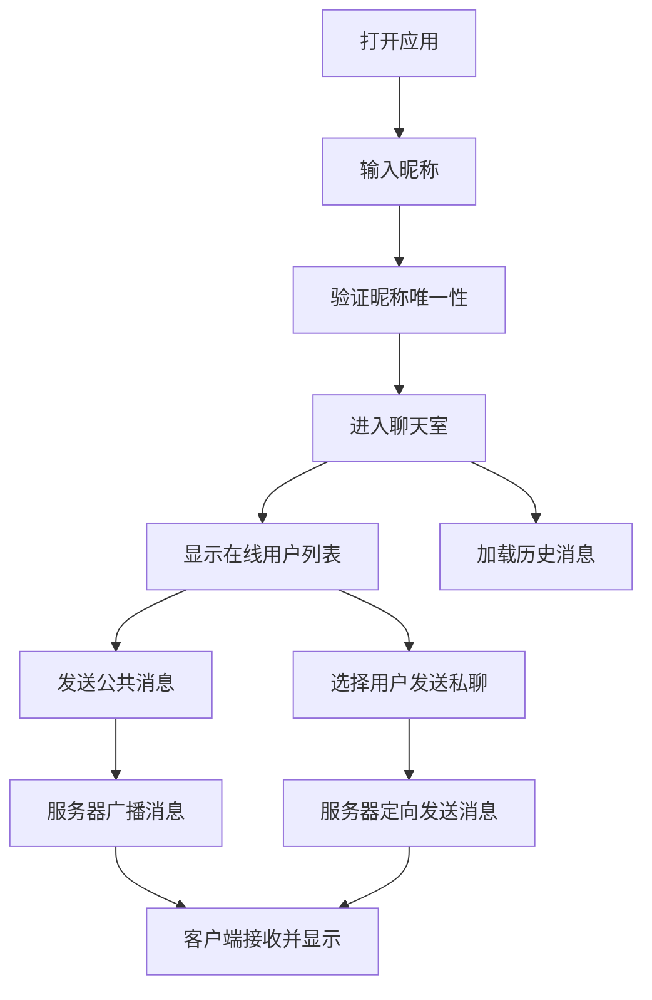

## 1. 产品概述

基于 FastAPI 和 WebSocket 的实时聊天室应用，支持多用户同时在线，提供公共消息和私聊功能。

- 主要用途：为用户提供一个简洁、实时的在线聊天平台
- 目标用户：需要即时通讯的普通网络用户
- 产品价值：低门槛、零注册、即开即用的实时聊天体验

## 2. 核心功能

### 2.1 用户角色

| 角色 | 注册方式 | 核心权限 |
|------|----------|----------|
| 普通用户 | 输入昵称即可进入（无需密码） | 发送公共消息、发送私聊消息、查看在线用户列表 |

### 2.2 功能模块

1. **登录页面**：昵称输入框、进入聊天室按钮
2. **聊天室主页面**：在线用户列表、聊天记录区域、消息发送区域

### 2.3 页面详情

| 页面名称 | 模块名称 | 功能描述 |
|----------|----------|----------|
| 登录页面 | 昵称输入模块 | 用户输入昵称，校验非空，点击进入聊天室 |
| 聊天室主页面 | 在线用户列表 | 实时显示所有在线用户，支持点击用户发起私聊 |
| 聊天室主页面 | 聊天记录区域 | 显示公共消息和私聊消息，自动滚动到底部，区分消息类型 |
| 聊天室主页面 | 消息发送区域 | 输入消息内容，选择发送对象（全体/指定用户），发送消息 |

## 3. 核心流程

用户打开应用 → 输入昵称 → 进入聊天室 → 查看在线用户 → 发送公共消息或私聊消息 → 接收实时消息推送

## 4. 用户界面设计

### 4.1 设计风格

- 主色调：蓝色系（#0d6efd），体现科技感和信任感
- 辅助色：绿色（#198754）表示在线状态，灰色表示离线/系统消息
- 按钮风格：Bootstrap 默认圆角按钮，悬停有轻微阴影效果
- 字体：系统默认无衬线字体，保持简洁易读
- 布局风格：左侧在线用户列表，右侧聊天区域，底部消息输入框
- 图标风格：使用 Bootstrap 内置图标，简洁统一

### 4.2 页面设计概述

| 页面名称 | 模块名称 | UI 元素 |
|----------|----------|----------|
| 登录页面 | 昵称输入模块 | 居中卡片布局、标题、输入框、进入按钮、友好提示文字 |
| 聊天室主页面 | 在线用户列表 | 侧边栏、用户头像、昵称、在线状态指示器、用户数统计 |
| 聊天室主页面 | 聊天记录区域 | 消息气泡、发送者昵称、时间戳、私聊消息特殊标记 |
| 聊天室主页面 | 消息发送区域 | 下拉选择发送对象、文本输入框、发送按钮 |

### 4.3 响应式设计

- 桌面端：左侧用户列表（25%宽度）+ 右侧聊天区域（75%宽度）
- 移动端：默认隐藏用户列表，可通过按钮切换显示，聊天区域占满屏幕
- 触摸优化：按钮尺寸适合点击，输入框自动聚焦

### 4.4 交互细节

- 新消息到达时，聊天区域自动滚动到底部
- 私聊消息有特殊背景色和标签，与公共消息区分
- 用户进入/退出聊天室时，系统消息通知所有在线用户
- 输入框支持回车键发送消息
