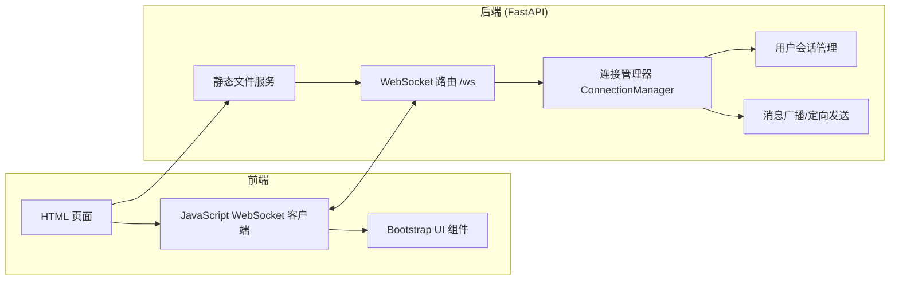
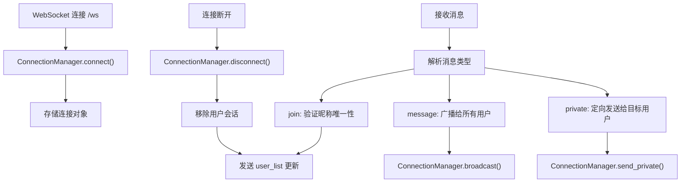

## 1. 架构设计



## 2. 技术栈描述

- **前端**: HTML5 + Vanilla JavaScript + Bootstrap 5.3
  - 使用原生 WebSocket API 实现实时通信
  - Bootstrap 提供 UI 组件和响应式布局
  - 无需构建工具，直接运行

- **后端**: Python 3.8+ + FastAPI + Uvicorn
  - FastAPI 提供 WebSocket 支持和静态文件服务
  - Uvicorn 作为 ASGI 服务器
  - 内存存储用户会话（无需数据库）

- **部署**: 单进程运行，支持多用户同时连接

## 3. 路由定义

| 路由 | 方法 | 用途 |
|------|------|------|
| `/` | GET | 返回聊天室主页面（包含登录和聊天界面） |
| `/ws` | WebSocket | WebSocket 连接端点，处理所有实时消息 |

## 4. WebSocket 消息协议

### 4.1 消息类型定义

客户端发送的消息格式：

```json
{
  "type": "join|message|private",
  "nickname": "string",
  "content": "string",
  "target": "string (可选，私聊时使用)"
}
```

服务器推送的消息格式：

```json
{
  "type": "system|message|private|user_list",
  "sender": "string",
  "content": "string",
  "timestamp": "ISO 8601 string",
  "target": "string (可选)",
  "users": ["string"] (user_list 类型时使用)
}
```

### 4.2 消息类型说明

| 类型 | 发送方 | 用途 |
|------|--------|------|
| `join` | 客户端 | 用户加入聊天室，携带昵称 |
| `message` | 客户端/服务端 | 公共聊天消息 |
| `private` | 客户端/服务端 | 私聊消息，需指定 target |
| `system` | 服务端 | 系统通知（用户加入/离开） |
| `user_list` | 服务端 | 在线用户列表更新 |

## 5. 后端架构



## 6. 数据模型

### 6.1 用户会话数据结构

```python
# 内存存储
active_connections: Dict[str, WebSocket] = {
    "nickname1": websocket_object_1,
    "nickname2": websocket_object_2
}
```

### 6.2 消息数据结构

```python
class ChatMessage(BaseModel):
    type: str
    nickname: Optional[str] = None
    content: Optional[str] = None
    target: Optional[str] = None
```

## 7. 项目目录结构

```
project/
├── main.py              # FastAPI 主程序，包含 WebSocket 路由和连接管理
├── static/
│   └── index.html       # 前端页面（HTML/JS/Bootstrap）
└── requirements.txt     # Python 依赖
```
