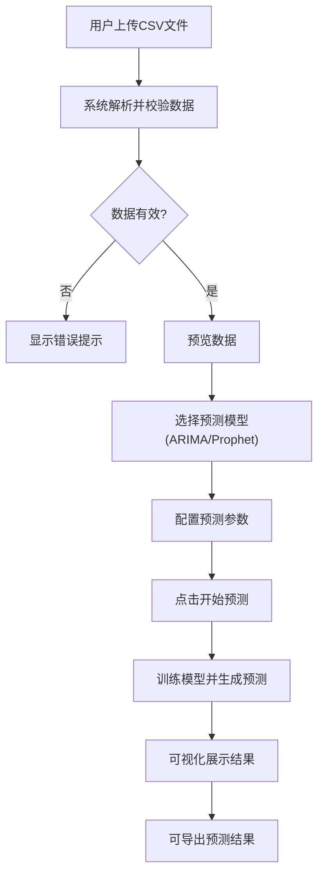

## 1. 产品概述

时间序列预测Web应用，支持用户上传CSV数据文件，使用ARIMA或Facebook Prophet模型进行未来趋势预测，可视化展示历史数据、预测曲线及置信区间。

- **主要用途**：为数据分析人员和业务决策者提供便捷的时间序列预测工具
- **解决问题**：无需复杂编程即可进行专业的时间序列分析和预测
- **目标用户**：数据分析师、业务运营人员、科研人员
- **产品价值**：降低预测分析门槛，提供直观的可视化结果展示

## 2. 核心功能

### 2.1 用户角色

| 角色 | 注册方式 | 核心权限 |
|------|----------|----------|
| 普通用户 | 无需注册，直接使用 | 上传数据、选择模型、调整参数、查看预测结果 |

### 2.2 功能模块

1. **数据上传模块**：CSV文件上传、数据格式校验、数据预览
2. **模型选择模块**：ARIMA/Prophet模型切换、参数配置
3. **预测配置模块**：预测步数设置、ARIMA参数手动调整或自动选择
4. **可视化展示模块**：历史数据曲线、预测曲线、置信区间展示
5. **结果导出模块**：预测结果下载

### 2.3 页面详情

| 页面名称 | 模块名称 | 功能描述 |
|----------|----------|----------|
| 主页 | 数据上传区 | 支持拖拽或点击上传CSV文件，显示文件格式要求 |
| 主页 | 模型配置区 | 选择ARIMA或Prophet模型，配置预测步数和模型参数 |
| 主页 | 可视化区 | 使用Plotly展示历史数据、预测曲线和置信区间 |
| 主页 | 结果导出区 | 下载预测结果为CSV文件 |

## 3. 核心流程

## 4. 用户界面设计

### 4.1 设计风格

- **主色调**：深蓝色(#1e3a5f)作为主色，科技感十足，体现数据分析的专业性
- **辅助色**：青绿色(#00d4aa)作为强调色，用于按钮和关键交互元素
- **背景色**：浅灰色渐变背景，营造清爽专业的氛围
- **按钮风格**：圆角矩形按钮，带有微妙的悬停动画效果
- **字体**：使用现代无衬线字体，标题加粗，正文清晰易读
- **布局风格**：卡片式布局，清晰的功能分区，左侧配置区+右侧可视化区的双栏布局
- **图标风格**：简洁线性图标，与整体科技风格统一

### 4.2 页面设计概览

| 页面名称 | 模块名称 | UI元素 |
|----------|----------|--------|
| 主页 | 头部区域 | 应用标题、简短描述、品牌标识 |
| 主页 | 数据上传卡片 | 拖拽上传区域、文件选择按钮、格式说明 |
| 主页 | 模型配置卡片 | 模型选择下拉框、预测步数输入、参数配置面板 |
| 主页 | ARIMA参数面板 | p/d/q参数滑块、自动选择开关 |
| 主页 | 可视化区域 | Plotly交互式图表、图例说明、图表工具栏 |
| 主页 | 结果信息区 | 模型评估指标、预测数据表格预览 |

### 4.3 响应式设计

- **桌面端**：双栏布局，左侧30%配置区，右侧70%可视化区
- **平板端**：上下布局，配置区在上，可视化区在下
- **移动端**：单列滚动布局，优化触控交互
- 采用响应式断点：1200px以上桌面，768-1200px平板，768px以下移动端

### 4.4 交互动效

- 页面加载时的渐入动画
- 卡片悬停时的轻微上浮和阴影加深效果
- 参数调整时的实时反馈
- 预测计算时的加载动画
- 图表数据点的悬停提示
