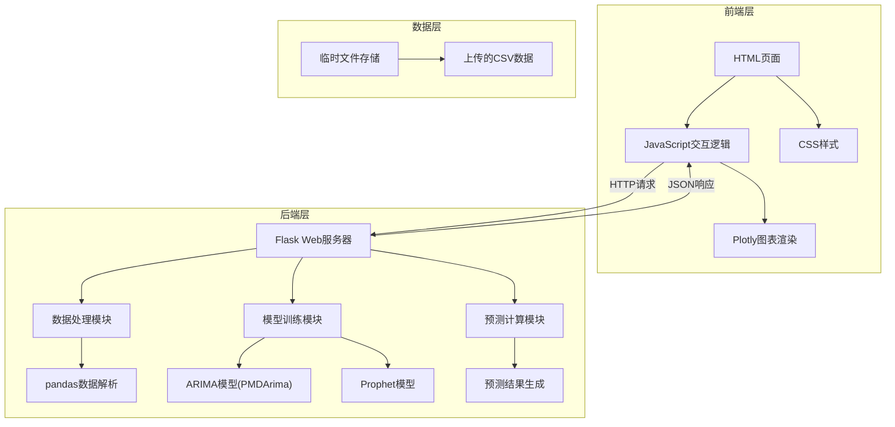

## 1. 架构设计



## 2. 技术描述

- **前端**：原生HTML5 + CSS3 + 原生JavaScript (ES6+) + Plotly.js
- **后端**：Flask@2.3.x + Python@3.9+
- **数据处理**：pandas@2.x + numpy@1.24+
- **时间序列模型**：
  - ARIMA: pmdarima@2.x (自动参数选择) + statsmodels@0.14+
  - Prophet: prophet@1.1+
- **可视化**：Plotly.js (前端)
- **初始化方式**：直接创建项目结构，无需脚手架工具

## 3. 目录结构

```
project/
├── app.py                      # Flask主应用入口
├── requirements.txt            # Python依赖包
├── static/
│   ├── css/
│   │   └── style.css          # 页面样式
│   └── js/
│       └── app.js             # 前端交互逻辑
├── templates/
│   └── index.html             # 主页面模板
├── utils/
│   ├── data_processor.py      # 数据处理工具
│   ├── arima_model.py         # ARIMA模型封装
│   └── prophet_model.py       # Prophet模型封装
└── uploads/                   # 临时上传文件目录
```

## 4. 路由定义

| 路由 | 方法 | 用途 |
|------|------|------|
| `/` | GET | 主页面，渲染预测界面 |
| `/api/upload` | POST | 上传CSV数据文件 |
| `/api/preview` | POST | 预览上传的数据 |
| `/api/predict` | POST | 执行预测并返回结果 |
| `/api/download` | POST | 下载预测结果CSV |

## 5. API定义

### 5.1 上传文件 `/api/upload`

**请求**:
```
Content-Type: multipart/form-data
Body: file=<CSV文件>
```

**成功响应**:
```json
{
  "success": true,
  "file_id": "uuid-string",
  "columns": ["date", "value"],
  "row_count": 1000,
  "preview": [
    {"date": "2023-01-01", "value": 100},
    {"date": "2023-01-02", "value": 105}
  ]
}
```

### 5.2 预测 `/api/predict`

**请求**:
```json
{
  "file_id": "uuid-string",
  "model": "arima",
  "periods": 30,
  "arima_params": {
    "auto": true,
    "p": 1,
    "d": 1,
    "q": 1
  }
}
```

**成功响应**:
```json
{
  "success": true,
  "historical": {
    "dates": ["2023-01-01", "2023-01-02", "..."],
    "values": [100, 105, "..."]
  },
  "forecast": {
    "dates": ["2024-01-01", "2024-01-02", "..."],
    "values": [150, 152, "..."],
    "lower": [145, 146, "..."],
    "upper": [155, 158, "..."]
  },
  "model_info": {
    "model": "arima",
    "parameters": {"p": 2, "d": 1, "q": 2},
    "aic": 1234.56
  },
  "metrics": {
    "rmse": 5.23,
    "mae": 3.45
  }
}
```

## 6. 核心模块设计

### 6.1 数据处理模块 (`data_processor.py`)

```python
class DataProcessor:
    def load_csv(file_path) -> DataFrame
    def validate_data(df: DataFrame) -> bool
    def preprocess(df: DataFrame) -> DataFrame
    def split_train_test(df: DataFrame, test_size: float) -> tuple
```

### 6.2 ARIMA模型模块 (`arima_model.py`)

```python
class ARIMAForecaster:
    def auto_select_params(data: Series) -> tuple  # (p,d,q)
    def train(data: Series, order: tuple) -> model
    def predict(model, periods: int) -> dict
    def evaluate(model, test_data: Series) -> dict
```

### 6.3 Prophet模型模块 (`prophet_model.py`)

```python
class ProphetForecaster:
    def train(df: DataFrame) -> model
    def predict(model, periods: int) -> dict
    def evaluate(model, test_data: DataFrame) -> dict
```

## 7. 技术要点

1. **CSV数据格式要求**：两列数据，第一列为日期(date)，第二列为数值(value)
2. **ARIMA自动参数选择**：使用pmdarima的auto_arima函数，基于AIC准则选择最优参数
3. **置信区间计算**：ARIMA使用预测标准差，Prophet内置置信区间输出
4. **Plotly图表**：前端使用Plotly.js绘制交互式折线图，支持缩放、悬停查看数据
5. **文件管理**：使用UUID作为文件标识，上传文件临时存储在uploads目录
6. **错误处理**：统一的错误响应格式，包含错误码和错误信息
