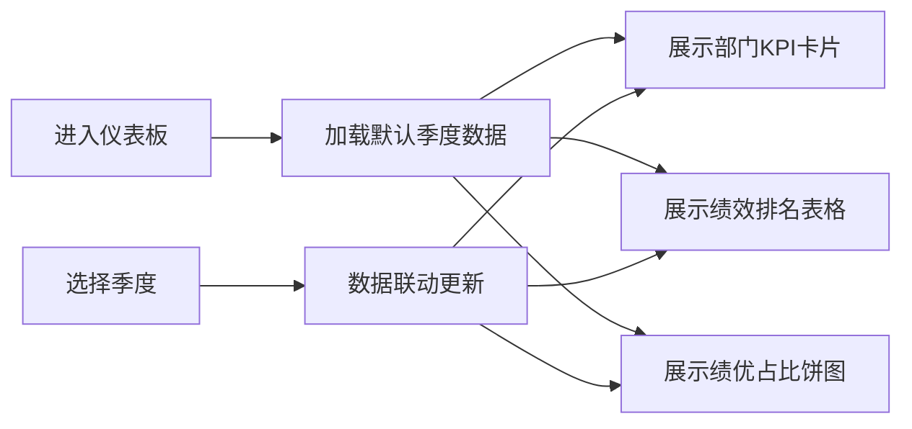

## 1. 产品概述
员工绩效仪表板是一个企业级数据可视化平台，帮助管理层实时监控各部门 KPI 完成情况、个人绩效排名及绩优员工分布，支持按季度筛选和趋势分析。
- 主要解决绩效数据分散、难以快速洞察的问题，目标用户为企业管理者、HR 和部门主管
- 产品价值在于提升绩效管理效率，助力数据驱动决策

## 2. 核心功能

### 2.1 用户角色
| 角色 | 注册方式 | 核心权限 |
|------|----------|----------|
| 管理者 | 企业账号登录 | 查看所有部门数据、筛选、导出报表 |
| 部门主管 | 企业账号登录 | 查看本部门数据、员工排名 |

### 2.2 功能模块
1. **仪表板主页**：部门 KPI 卡片展示、个人绩效排名表格、绩优员工占比饼图
2. **筛选交互**：季度筛选器、数据实时联动更新
3. **趋势分析**：各部门绩效趋势 Sparkline 微线图

### 2.3 页面详情
| 页面名称 | 模块名称 | 功能描述 |
|-----------|-------------|---------------------|
| 仪表板主页 | 部门卡片 | 展示部门名称、KPI 完成率进度条、趋势微线图 |
| 仪表板主页 | 排名表格 | 展示员工姓名、销售额、完成率、评级，支持排序 |
| 仪表板主页 | 饼图统计 | 展示绩优/良好/达标/待改进员工占比 |
| 仪表板主页 | 季度筛选器 | 支持 Q1-Q4 季度切换，数据实时刷新 |

## 3. 核心流程
用户进入仪表板 → 默认展示当前季度数据 → 选择季度筛选器 → 所有组件联动更新 → 查看各部门详情和员工排名

## 4. 界面设计

### 4.1 设计风格
- 主色调：深蓝色系（代表专业、信任），辅以翡翠绿、琥珀橙作为状态色
- 卡片风格：圆角矩形、柔和阴影、悬停微抬升效果
- 字体：标题使用 Playfair Display（优雅衬线），正文使用 Inter（现代无衬线）
- 布局：响应式网格布局，卡片错落有致
- 图标：使用 lucide-react 线性图标

### 4.2 页面设计概览
| 页面名称 | 模块名称 | UI 元素 |
|-----------|-------------|-------------|
| 仪表板主页 | 顶部导航 | 标题、季度筛选下拉框、刷新按钮 |
| 仪表板主页 | 部门卡片区 | 4 列网格，每张卡片包含进度条和微线图 |
| 仪表板主页 | 数据展示区 | 左侧排名表格、右侧饼图统计 |
| 仪表板主页 | 动画效果 | 卡片入场错峰动画、数据切换过渡效果 |

### 4.3 响应式
- 桌面端：4 列部门卡片，表格+饼图左右布局
- 平板端：2 列部门卡片，表格饼图上下布局
- 移动端：单列布局，内容自适应

### 4.4 视觉细节
- 背景：浅灰蓝渐变背景，带微妙噪点纹理
- 卡片：白色背景 + 1px 边框 + 8px 圆角 + 柔和投影
- 进度条：渐变填充，末端圆角，带完成率数字
- Sparkline：细线条，终点高亮圆点
