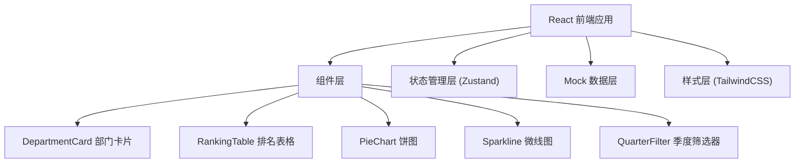

## 1. 架构设计


## 2. 技术描述
- 前端：React@18 + TypeScript + Vite
- 样式：TailwindCSS@3
- 图表：自定义 SVG 实现（Sparkline、饼图）
- 状态管理：Zustand
- 图标：lucide-react
- 数据：前端 Mock 数据，无需后端

## 3. 路由定义
| 路由 | 用途 |
|-------|---------|
| / | 仪表板主页 |

## 4. 数据模型

### 4.1 部门数据类型
```typescript
interface Department {
  id: string;
  name: string;
  kpiTarget: number;
  kpiCurrent: number;
  completionRate: number;
  trend: number[]; // 近6个月数据
}
```

### 4.2 员工数据类型
```typescript
interface Employee {
  id: string;
  name: string;
  department: string;
  sales: number;
  completionRate: number;
  rating: 'S' | 'A' | 'B' | 'C';
}
```

### 4.3 绩效分布类型
```typescript
interface PerformanceDistribution {
  excellent: number;
  good: number;
  qualified: number;
  improvement: number;
}
```

## 5. 项目结构
```
src/
├── components/
│   ├── DepartmentCard.tsx
│   ├── RankingTable.tsx
│   ├── PieChart.tsx
│   ├── Sparkline.tsx
│   └── QuarterFilter.tsx
├── store/
│   └── useDashboardStore.ts
├── data/
│   └── mockData.ts
├── types/
│   └── index.ts
├── App.tsx
├── main.tsx
└── index.css
```
