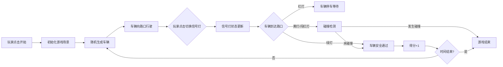

## 1. 产品概述

十字路口交通控制游戏是一款休闲益智类网页游戏，玩家通过控制红绿灯切换，引导不同方向的车辆安全通过十字路口，避免碰撞。游戏考验玩家的反应能力和策略思维。

- 核心玩法：点击红绿灯切换红/黄/绿三色，控制车辆通行
- 目标用户：休闲游戏爱好者，所有年龄段
- 市场价值：轻松有趣的小游戏，适合碎片化时间娱乐

## 2. 核心功能

### 2.1 功能模块

1. **游戏主界面**：十字路口场景、车辆显示、信号灯、得分面板、倒计时
2. **车辆生成系统**：四个方向随机生成车辆，车辆自动向路口行驶
3. **信号灯控制**：玩家点击切换信号灯状态（红→黄→绿→红）
4. **碰撞检测系统**：检测车辆间碰撞、闯红灯行为
5. **计分系统**：记录成功通过的车辆数，游戏结束显示最终得分

### 2.2 页面详情

| 页面名称 | 模块名称 | 功能描述 |
|-----------|-------------|---------------------|
| 游戏主页面 | 十字路口场景 | 展示四车道十字路口，车辆行驶动画 |
| 游戏主页面 | 信号灯组件 | 四个方向信号灯，可点击切换状态 |
| 游戏主页面 | 信息面板 | 显示当前得分、剩余时间、游戏状态 |
| 游戏主页面 | 开始/重新开始按钮 | 控制游戏流程 |

## 3. 核心流程

## 4. 用户界面设计

### 4.1 设计风格

- 主色调：深灰色背景，搭配交通信号灯标准色（红、黄、绿）
- 视觉风格：扁平化卡通风格，简洁明了
- 按钮样式：圆角矩形，带有 hover 动画效果
- 字体：现代无衬线字体，数字使用等宽字体
- 布局：居中展示十字路口，信息面板置于顶部

### 4.2 页面设计概述

| 页面名称 | 模块名称 | UI 元素 |
|-----------|-------------|-------------|
| 游戏主页面 | 十字路口 | 深灰色路面，白色车道线，中央黄色交叉线 |
| 游戏主页面 | 车辆 | 彩色矩形小车，不同方向不同颜色 |
| 游戏主页面 | 信号灯 | 经典三色圆形灯，高亮状态发光效果 |
| 游戏主页面 | 信息面板 | 半透明黑色背景，白色文字，得分醒目显示 |
| 游戏主页面 | 控制按钮 | 绿色开始按钮，红色重新开始按钮 |

### 4.3 响应式

- 桌面端优先，自适应不同屏幕尺寸
- 移动端保持游戏区域比例缩放
- 触摸操作优化，确保点击区域足够大
