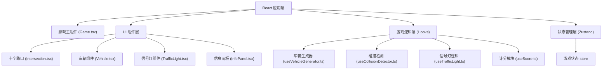

## 1. 架构设计



## 2. 技术描述

- **前端框架**: React@18 + TypeScript + Vite
- **样式方案**: TailwindCSS@3
- **状态管理**: Zustand
- **动画方案**: CSS Transitions + requestAnimationFrame
- **无后端，纯前端游戏**

## 3. 核心模块说明

### 3.1 车辆生成器 (useVehicleGenerator)
- 四个方向（上、下、左、右）随机生成车辆
- 控制生成频率，随游戏进行逐渐加快
- 车辆属性：方向、速度、颜色、位置

### 3.2 碰撞检测 (useCollisionDetector)
- 检测车辆之间的矩形碰撞
- 检测车辆闯红灯行为
- 触发游戏结束逻辑

### 3.3 信号灯逻辑 (useTrafficLight)
- 管理四个方向信号灯状态
- 点击切换：红 → 黄 → 绿 → 红
- 黄灯闪烁效果

### 3.4 计分模块 (useScore)
- 记录成功通过路口的车辆数
- 倒计时管理（默认 60 秒）
- 游戏结束统计

## 4. 数据模型

### 4.1 类型定义

```typescript
// 方向类型
type Direction = 'north' | 'south' | 'east' | 'west';

// 信号灯颜色
type LightColor = 'red' | 'yellow' | 'green';

// 车辆接口
interface Vehicle {
  id: string;
  direction: Direction;
  x: number;
  y: number;
  speed: number;
  color: string;
  width: number;
  height: number;
  hasPassed: boolean;
}

// 游戏状态
interface GameState {
  isPlaying: boolean;
  isGameOver: boolean;
  score: number;
  timeLeft: number;
  vehicles: Vehicle[];
  trafficLights: Record<Direction, LightColor>;
}
```

### 4.2 游戏常量

```typescript
const GAME_CONFIG = {
  GAME_DURATION: 60, // 游戏时长 60 秒
  CANVAS_WIDTH: 600,
  CANVAS_HEIGHT: 600,
  ROAD_WIDTH: 100,
  VEHICLE_WIDTH: 40,
  VEHICLE_HEIGHT: 60,
  VEHICLE_SPEED: 2,
  SPAWN_INTERVAL: 2000, // 初始生成间隔
  MIN_SPAWN_INTERVAL: 800, // 最小生成间隔
};
```

## 5. 项目结构

```
src/
├── components/
│   ├── Game.tsx              # 游戏主组件
│   ├── Intersection.tsx      # 十字路口画布
│   ├── Vehicle.tsx           # 车辆渲染组件
│   ├── TrafficLight.tsx      # 信号灯组件
│   └── InfoPanel.tsx         # 信息面板
├── hooks/
│   ├── useVehicleGenerator.ts # 车辆生成器
│   ├── useCollisionDetector.ts # 碰撞检测
│   ├── useTrafficLight.ts     # 信号灯逻辑
│   └── useScore.ts            # 计分模块
├── store/
│   └── gameStore.ts          # Zustand 状态管理
├── types/
│   └── game.ts               # 类型定义
├── utils/
│   └── constants.ts          # 游戏常量
├── App.tsx
├── main.tsx
└── index.css
```
