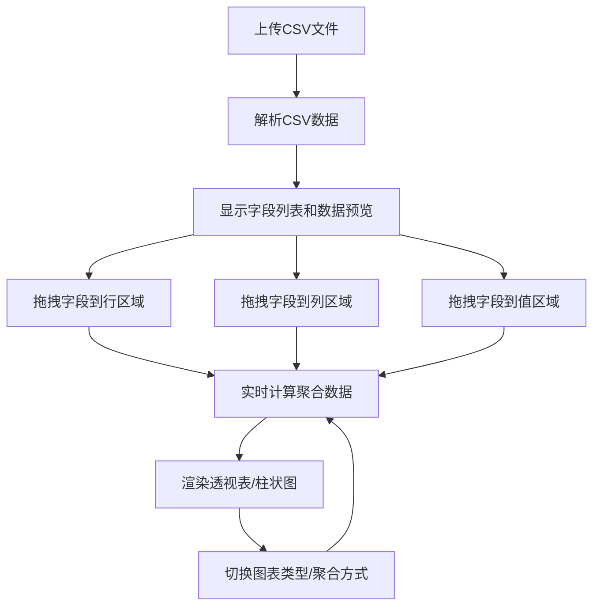

## 1. 产品概述

CSV/Excel 快速透视图工具是一个前端数据可视化工具，让用户能够快速上传 CSV 文件并通过拖拽操作生成数据透视表和图表。类似 Excel 透视表的简化版，帮助用户快速分析和理解数据。

- 主要用途：快速数据分析、数据透视、可视化展示
- 目标用户：数据分析师、运营人员、产品经理、需要快速查看数据洞察的用户

## 2. 核心功能

### 2.1 用户角色
| 角色 | 注册方式 | 核心权限 |
|------|----------|----------|
| 普通用户 | 无需注册，直接使用 | 上传文件、拖拽字段、生成图表 |

### 2.2 功能模块
1. **数据上传模块**：CSV 文件上传、数据解析预览
2. **拖拽配置模块**：字段列表、行/列/值区域拖拽、聚合方式选择
3. **图表展示模块**：透视表格、柱状图切换、数据展示

### 2.3 页面详情
| 页面名称 | 模块名称 | 功能描述 |
|---------|----------|---------|
| 主页面 | 文件上传区 | 拖拽或点击上传 CSV 文件，显示上传状态 |
| 主页面 | 数据预览区 | 显示解析后的原始数据前 N 行，支持滚动查看 |
| 主页面 | 字段配置区 | 可拖拽的字段列表，行/列/值三个放置区域 |
| 主页面 | 图表展示区 | 透视表格和柱状图切换显示，支持聚合方式选择 |

## 3. 核心流程

用户上传 CSV 文件 → 系统自动解析并显示字段列表 → 用户拖拽字段到行/列/值区域 → 系统实时计算并生成透视结果 → 用户切换图表类型或聚合方式 → 结果实时更新

## 4. 用户界面设计

### 4.1 设计风格
- **主色调**：深蓝色 #1e3a8a，代表专业和数据感
- **辅助色**：青蓝色 #0ea5e9，用于交互元素和高亮
- **背景色**：浅灰渐变背景，营造专业感
- **按钮风格**：圆角矩形，悬停有微动画效果
- **字体**：使用 Space Grotesk 作为展示字体，Inter 作为正文字体
- **布局风格**：卡片式布局，清晰的功能分区

### 4.2 页面设计概述
| 页面名称 | 模块名称 | UI 元素 |
|---------|----------|---------|
| 主页面 | 文件上传区 | 虚线边框拖拽区域，上传图标，文件选择按钮 |
| 主页面 | 字段配置区 | 可拖拽的字段标签，三个放置区域（行/列/值），聚合方式下拉选择 |
| 主页面 | 图表展示区 | 表格/柱状图切换标签，数据表格，Chart.js 图表 |
| 主页面 | 数据预览区 | 滚动表格，显示原始数据 |

### 4.3 响应性
- 桌面端：三栏布局（字段区、配置区、图表区）
- 平板端：两栏布局，图表区自适应
- 移动端：单列布局，支持垂直滚动
- 拖拽操作在移动端支持触摸事件

