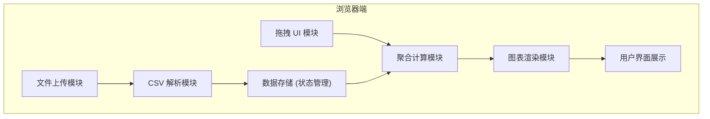
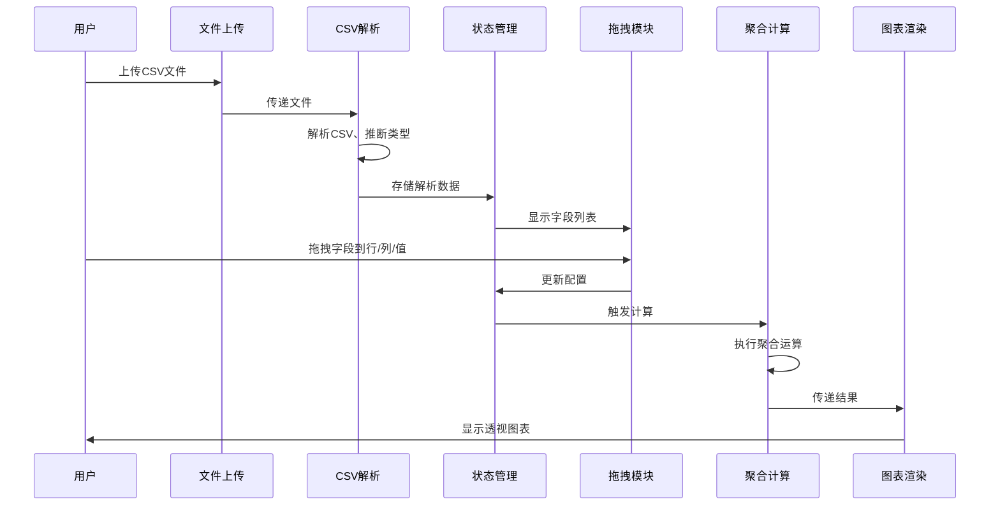

## 1. 架构设计

本项目为纯前端应用，无需后端服务，所有功能在浏览器端完成。



## 2. 技术描述

- **前端框架**：React@18 + TypeScript
- **构建工具**：Vite
- **样式方案**：Tailwind CSS 3
- **图表库**：Chart.js + react-chartjs-2
- **拖拽库**：@dnd-kit/core（React 拖拽解决方案）
- **CSV 解析**：Papa Parse
- **状态管理**：React useState/useReducer

## 3. 核心模块划分

| 模块 | 文件路径 | 功能描述 |
|------|----------|---------|
| 数据解析 | `src/utils/csvParser.ts` | CSV 文件解析、类型推断、数据转换 |
| 拖拽 UI | `src/components/DragDrop/` | 可拖拽字段、放置区域组件 |
| 聚合计算 | `src/utils/aggregator.ts` | 求和、计数、平均值等聚合逻辑 |
| 图表渲染 | `src/components/Charts/` | 透视表格、柱状图渲染组件 |
| 主应用 | `src/App.tsx` | 主页面布局、状态管理、交互逻辑 |

## 4. 数据结构定义

```typescript
// CSV 解析后的数据结构
interface CSVData {
  headers: string[];
  rows: Record<string, any>[];
  columnTypes: Record<string, 'string' | 'number' | 'date'>;
}

// 透视配置
interface PivotConfig {
  rows: string[];      // 行字段
  columns: string[];   // 列字段
  values: ValueConfig[]; // 值字段配置
}

interface ValueConfig {
  field: string;
  aggregation: 'sum' | 'count' | 'average';
}

// 透视结果
interface PivotResult {
  rowHeaders: string[][];
  colHeaders: string[][];
  data: (number | null)[][];
}
```

## 5. 核心流程时序



