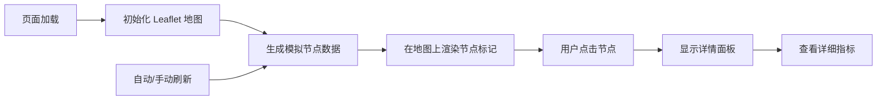

## 1. 产品概述

CDN 节点状态监控系统，实时展示全球 CDN 节点的运行状态，帮助运维人员快速识别和定位网络问题。

- 主要用途：监控全球多个地理节点的延迟、带宽、可用性等关键指标
- 目标用户：网络运维工程师、CDN 管理员、技术支持团队
- 产品价值：通过可视化地图直观展示节点状态，提升故障排查效率

## 2. 核心功能

### 2.1 功能模块

1. **主监控面板**：世界地图展示、节点标记、状态概览
2. **详情面板**：节点详细指标展示、历史趋势
3. **刷新控制**：手动刷新、自动刷新开关、刷新间隔设置

### 2.2 页面详情

| 页面名称 | 模块名称 | 功能描述 |
|-----------|-------------|---------------------|
| 主监控面板 | 世界地图 | 使用 Leaflet 展示世界地图，支持缩放和拖拽 |
| 主监控面板 | 节点标记 | 在地图上标记全球 CDN 节点，颜色表示延迟（绿/黄/红） |
| 主监控面板 | 状态概览 | 顶部展示总体健康度、正常节点数、警告节点数、异常节点数 |
| 详情面板 | 指标展示 | 点击节点后显示详细指标（丢包率、带宽使用率、吞吐量） |
| 详情面板 | 趋势图表 | 展示最近一段时间的指标变化趋势 |
| 刷新控制 | 控制栏 | 手动刷新按钮、自动刷新开关、刷新间隔选择（5s/10s/30s） |

## 3. 核心流程

## 4. 用户界面设计

### 4.1 设计风格

- 主色调：深色科技感主题，以深蓝/深灰为底色
- 状态色：绿色 (#10b981) 表示正常，黄色 (#f59e0b) 表示警告，红色 (#ef4444) 表示异常
- 字体：使用现代无衬线字体，标题加粗，数据等宽显示
- 布局：地图居中占主要区域，顶部状态栏，右侧可滑出详情面板
- 视觉效果：节点标记带脉冲动画，面板采用毛玻璃效果

### 4.2 页面设计概览

| 页面名称 | 模块名称 | UI 元素 |
|-----------|-------------|-------------|
| 主监控面板 | 顶部状态栏 | 统计卡片、状态图标、数字动画 |
| 主监控面板 | 地图区域 | Leaflet 地图、彩色节点标记、脉冲动画 |
| 主监控面板 | 控制栏 | 刷新按钮、开关控件、下拉选择器 |
| 详情面板 | 信息卡片 | 指标列表、进度条、迷你图表 |

### 4.3 响应式

- 桌面端：地图居中，详情面板右侧滑出
- 平板端：地图占满屏幕，详情面板底部滑出
- 移动端：地图占满屏幕，详情面板全屏覆盖

### 4.4 视觉细节

- 节点标记：圆形标记，内部白色圆点，外部根据状态色发光
- 鼠标交互：悬停显示节点名称提示，点击选中高亮
- 动画效果：数据更新时数字平滑过渡，面板滑入滑出
