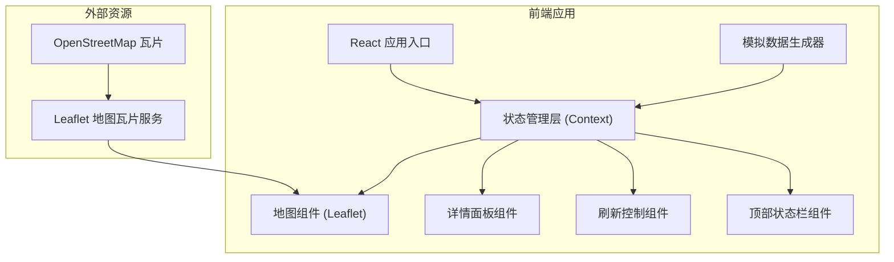

## 1. 架构设计



## 2. 技术描述

- 前端：React@18 + TypeScript + Vite
- 样式：TailwindCSS@3
- 地图：Leaflet@1.9 + react-leaflet@4
- 初始化工具：Vite
- 后端：无（纯前端模拟数据）
- 数据库：无（内存模拟数据）

## 3. 目录结构

```
src/
├── components/
│   ├── Map/
│   │   ├── MapView.tsx        # 地图主视图
│   │   ├── NodeMarker.tsx     # 节点标记组件
│   │   └── map.css            # 地图自定义样式
│   ├── StatusBar/
│   │   └── StatusBar.tsx      # 顶部状态栏
│   ├── DetailPanel/
│   │   └── DetailPanel.tsx    # 详情面板
│   └── RefreshControl/
│       └── RefreshControl.tsx # 刷新控制组件
├── context/
│   └── NodeContext.tsx        # 节点数据状态管理
├── data/
│   └── mockNodes.ts           # 模拟节点数据
├── types/
│   └── index.ts               # TypeScript 类型定义
├── utils/
│   └── dataGenerator.ts       # 数据生成工具函数
├── App.tsx
├── main.tsx
└── index.css
```

## 4. 类型定义

```typescript
interface CDNNode {
  id: string;
  name: string;
  location: string;
  lat: number;
  lng: number;
  latency: number;      // 延迟 (ms)
  bandwidth: number;    // 带宽使用率 (%)
  packetLoss: number;   // 丢包率 (%)
  availability: number; // 可用性 (%)
  throughput: number;   // 吞吐量 (Mbps)
  status: 'healthy' | 'warning' | 'critical';
  lastUpdated: Date;
  history: {
    latency: number[];
    bandwidth: number[];
    packetLoss: number[];
  };
}

interface NodeContextType {
  nodes: CDNNode[];
  selectedNode: CDNNode | null;
  setSelectedNode: (node: CDNNode | null) => void;
  refreshData: () => void;
  autoRefresh: boolean;
  setAutoRefresh: (enabled: boolean) => void;
  refreshInterval: number;
  setRefreshInterval: (interval: number) => void;
  isRefreshing: boolean;
}
```

## 5. 核心组件说明

### 5.1 MapView 组件
- 初始化 Leaflet 地图，设置世界视图
- 遍历节点数据渲染 NodeMarker
- 处理地图缩放和拖拽交互
- 集成 OpenStreetMap 瓦片图层

### 5.2 NodeMarker 组件
- 根据延迟状态显示不同颜色（绿/黄/红）
- 添加脉冲动画效果
- 点击事件触发选中状态
- 悬停显示节点名称 Tooltip

### 5.3 DetailPanel 组件
- 显示选中节点的详细指标
- 使用进度条展示百分比数据
- 迷你折线图展示历史趋势
- 支持关闭和外部点击关闭

### 5.4 RefreshControl 组件
- 手动刷新按钮
- 自动刷新开关（Toggle）
- 刷新间隔下拉选择（5s/10s/30s/60s）
- 显示上次刷新时间

### 5.5 StatusBar 组件
- 统计总节点数、健康节点、警告节点、异常节点
- 计算并展示总体健康度百分比
- 数字变化时添加平滑过渡动画

## 6. 数据模拟逻辑

### 6.1 初始节点数据
- 全球 15-20 个主要城市节点
- 包含经纬度、城市名称、区域信息
- 初始指标在合理范围内随机生成

### 6.2 数据刷新逻辑
- 每次刷新在原有基础上小幅度波动
- 延迟波动范围：±15ms
- 带宽使用率波动范围：±5%
- 丢包率波动范围：±1%
- 小概率触发异常状态（用于演示）

### 6.3 状态判断规则
- Healthy：延迟 < 100ms 且 丢包率 < 1%
- Warning：延迟 100-200ms 或 丢包率 1-3%
- Critical：延迟 > 200ms 或 丢包率 > 3%
