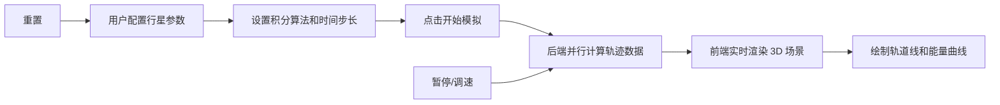

## 1. 产品概述

天体力学 N 体模拟系统是一个面向物理爱好者、学生和研究人员的交互式科学计算平台。用户可以自定义行星参数，通过高精度数值积分算法模拟多体系统的引力相互作用，实时可视化天体运动轨迹。

- 核心价值：将复杂的天体力学计算转化为直观的 3D 可视化体验，支持教学演示和科学探索
- 目标用户：物理教育工作者、天文爱好者、计算机模拟研究者

## 2. 核心功能

### 2.1 用户角色

| 角色 | 注册方式 | 核心权限 |
|------|----------|----------|
| 访客用户 | 无需注册 | 完整使用所有模拟功能，保存配置到本地 |

### 2.2 功能模块

1. **模拟控制面板**：行星参数配置、积分器选择、时间步长设置
2. **3D 可视化场景**：行星渲染、轨道轨迹、质心标记、视角控制
3. **播放控制**：开始/暂停、加速/减速、重置、单步执行
4. **数据监控面板**：总能量变化曲线、质心位置、系统状态统计
5. **预设场景库**：太阳系、双星系统、三体问题等经典案例

### 2.3 页面详情

| 页面名称 | 模块名称 | 功能描述 |
|----------|----------|----------|
| 主模拟页面 | 左侧控制面板 | 行星参数编辑、添加/删除行星、积分算法选择 |
| 主模拟页面 | 中央 3D 视图 | Three.js 渲染的天体运动场景，支持鼠标交互 |
| 主模拟页面 | 底部播放栏 | 播放控制按钮、速度调节滑块、时间显示 |
| 主模拟页面 | 右侧数据面板 | 能量曲线图、质心坐标、系统总质量/能量统计 |

## 3. 核心流程

用户在左侧面板配置行星的质量、初始位置和速度，选择积分算法（RK4 或 Hermite），点击开始后后端进行并行数值积分计算，前端接收时间序列数据并通过 Three.js 实时渲染。用户可随时暂停、调整速度或重置模拟。

## 4. 用户界面设计

### 4.1 设计风格

- **设计主题**：深空科技风，以黑色和深空蓝为主色调，配合星点背景营造宇宙氛围
- **主色调**：`#0a0e1a`（深空黑）、`#1a2744`（深空蓝）
- **强调色**：`#64b5f6`（行星蓝）、`#ff9800`（能量橙）、`#4caf50`（质心绿）
- **字体**：标题使用 `Orbitron` 科技字体，正文使用 `Inter` 现代无衬线字体
- **按钮风格**：半透明玻璃态按钮，带有微妙的发光效果
- **布局风格**：三栏布局，左侧控制面板、中央 3D 视图、右侧数据面板

### 4.2 页面设计概述

| 页面名称 | 模块名称 | UI 元素 |
|----------|----------|----------|
| 主模拟页面 | 左侧控制面板 | 可折叠面板、数值输入框、滑块、下拉选择器、动态行星列表 |
| 主模拟页面 | 中央 3D 视图 | 全屏 Canvas、星空背景、发光行星、半透明轨道线 |
| 主模拟页面 | 底部播放栏 | 图标按钮组、速度滑块、时间戳显示 |
| 主模拟页面 | 右侧数据面板 | 实时折线图、数值卡片、质心指示器 |

### 4.3 响应式设计

- 桌面端（≥1200px）：完整三栏布局
- 平板端（768px-1199px）：左右面板可折叠为抽屉
- 移动端（<768px）：垂直堆叠布局，优先显示 3D 视图

### 4.4 3D 场景设计

- **环境**：深邃宇宙背景，使用程序化星空粒子系统
- **光照**：点光源模拟恒星发光，环境光提供基础照明
- **相机**：PerspectiveCamera，支持轨道控制、缩放、平移
- **渲染优化**：行星使用 InstancedMesh，轨道线使用 BufferGeometry
- **后处理**：Bloom 发光效果、抗锯齿处理
