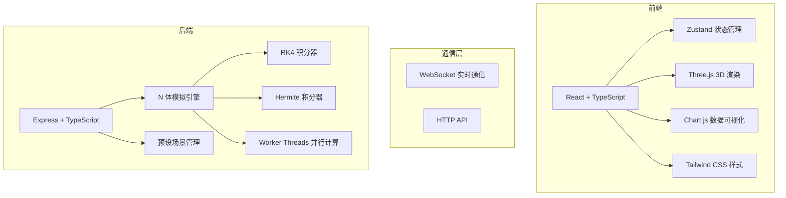
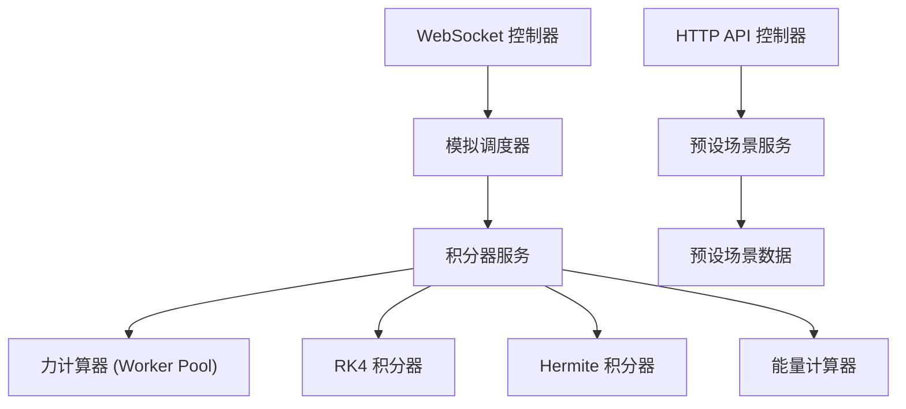
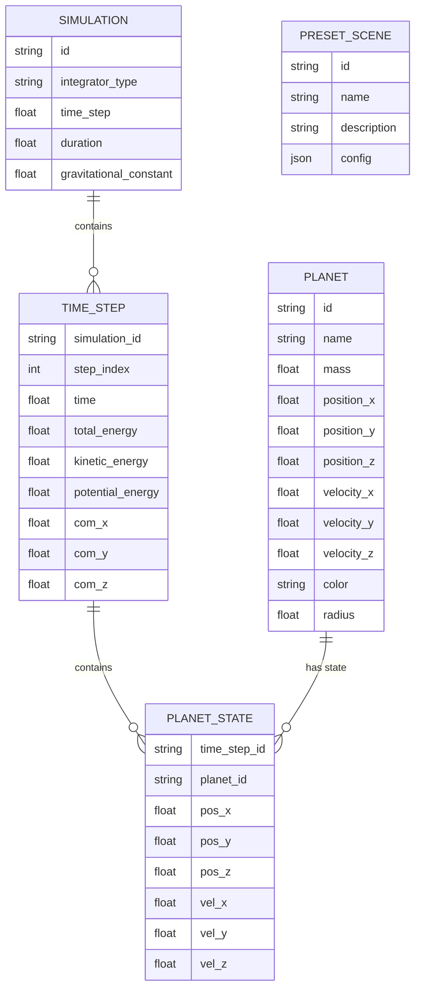

## 1. 架构设计



## 2. 技术描述

### 2.1 前端技术栈
- **框架**: React 18 + TypeScript
- **构建工具**: Vite 5
- **状态管理**: Zustand
- **3D 渲染**: Three.js 0.160 + @react-three/fiber + @react-three/drei
- **图表库**: Chart.js + react-chartjs-2
- **样式**: Tailwind CSS 3
- **图标**: Lucide React
- **通信**: Socket.io Client

### 2.2 后端技术栈
- **框架**: Express 4 + TypeScript
- **并行计算**: Node.js Worker Threads
- **WebSocket**: Socket.io
- **数值计算**: 自定义高精度积分算法

### 2.3 核心技术选型说明
1. **积分算法**: 实现 Runge-Kutta 4 (RK4) 和 Hermite 两种高精度积分器，用户可选择
2. **并行加速**: 使用 Worker Threads 将力的计算分摊到多个线程
3. **实时通信**: WebSocket 推送时间序列数据，确保渲染流畅
4. **3D 性能**: 使用 InstancedMesh 渲染多个行星，BufferGeometry 绘制轨道线

## 3. 路由定义

| 路由 | 用途 |
|------|------|
| / | 主模拟页面 |
| /api/simulate | 提交模拟配置，获取计算结果 |
| /api/presets | 获取预设场景列表 |
| /ws | WebSocket 实时数据推送 |

## 4. API 定义

### 4.1 类型定义

```typescript
// 行星参数
interface Planet {
  id: string;
  name: string;
  mass: number;
  position: [number, number, number];
  velocity: [number, number, number];
  color: string;
  radius: number;
}

// 模拟配置
interface SimulationConfig {
  planets: Planet[];
  integrator: 'rk4' | 'hermite';
  timeStep: number;
  duration: number;
  gravitationalConstant: number;
}

// 时间步状态
interface TimeStepData {
  time: number;
  positions: [number, number, number][];
  velocities: [number, number, number][];
  centerOfMass: [number, number, number];
  totalEnergy: number;
  kineticEnergy: number;
  potentialEnergy: number;
}

// 预设场景
interface PresetScene {
  id: string;
  name: string;
  description: string;
  config: SimulationConfig;
}
```

### 4.2 HTTP 接口

**GET /api/presets**
- 响应: `PresetScene[]`
- 说明: 获取所有预设场景

**POST /api/simulate**
- 请求体: `SimulationConfig`
- 响应: `{ simulationId: string }`
- 说明: 提交模拟任务，返回任务 ID

**GET /api/simulate/:id/result**
- 响应: `TimeStepData[]`
- 说明: 获取完整模拟结果（批量模式）

### 4.3 WebSocket 事件

**Client → Server**
- `start`: `{ config: SimulationConfig }` 开始实时模拟
- `pause`: 暂停模拟
- `resume`: 恢复模拟
- `reset`: 重置模拟
- `setSpeed`: `{ speed: number }` 设置模拟速度

**Server → Client**
- `step`: `TimeStepData` 推送单步数据
- `complete`: 模拟完成
- `error`: `{ message: string }` 错误信息

## 5. 服务器架构



## 6. 数据模型

### 6.1 核心数据结构



### 6.2 预设场景数据

内置以下经典场景：
1. **太阳系简化版**: 太阳 + 4 颗类地行星
2. **双星系统**: 两颗恒星相互绕转
3. **三体问题**: 三个质量相近的天体
4. **行星系**: 中心恒星 + 多颗行星
5. **碰撞模拟**: 两个天体近距离相遇
