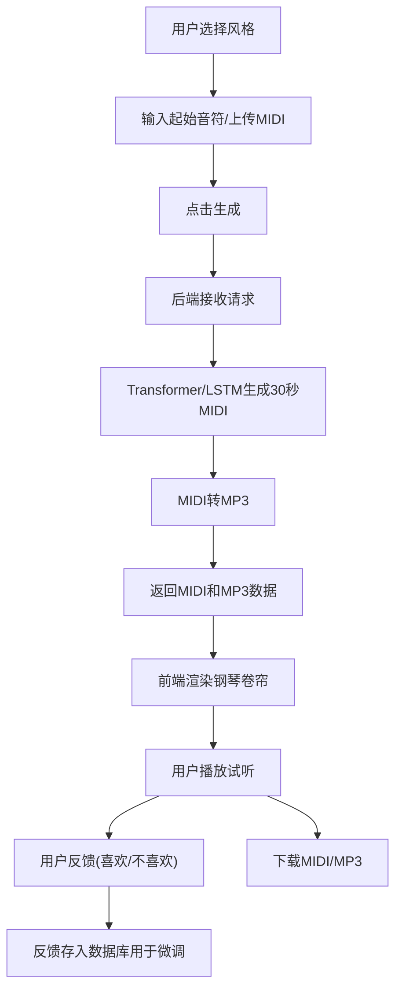

## 1. 产品概述

音乐生成与风格迁移系统，基于深度学习的 AI 音乐创作平台。用户可选择音乐风格（爵士、古典、电子）和起始音符，或上传 MIDI 文件作为种子，后端通过 Transformer/LSTM 模型生成 30 秒原创音乐，自动转换为 MP3 格式返回。前端提供钢琴卷帘可视化、播放控制、下载功能及用户反馈机制，实现人机协同的音乐创作体验。

面向音乐爱好者、创作者和教育场景，降低音乐创作门槛，探索 AI 辅助艺术创作的可能性。

## 2. 核心功能

### 2.1 用户角色

| 角色 | 注册方式 | 核心权限 |
|------|----------|----------|
| 普通用户 | 无需注册，匿名使用 | 音乐生成、播放、下载、反馈 |

### 2.2 功能模块

1. **音乐生成控制区**：风格选择器、起始音符输入、MIDI 文件上传、生成参数调节
2. **钢琴卷帘可视化**：实时乐谱展示、音符高亮播放、时间轴控制
3. **播放控制面板**：播放/暂停、进度条、音量调节、循环播放
4. **输出管理区**：MIDI 下载、MP3 下载、重新生成
5. **用户反馈系统**：喜欢/不喜欢按钮、反馈历史记录

### 2.3 页面详情

| 页面名称 | 模块名称 | 功能描述 |
|----------|----------|----------|
| 主页面 | 风格选择器 | 爵士/古典/电子三种风格卡片选择，带动画过渡效果 |
| 主页面 | 音符输入区 | 钢琴键盘组件选择起始音符，或拖拽上传 MIDI 文件 |
| 主页面 | 生成控制 | 生成按钮、时长设置（固定 30 秒）、随机种子选项 |
| 主页面 | 钢琴卷帘 | Canvas 渲染的 88 键钢琴卷帘，显示生成的音符 |
| 主页面 | 播放控制 | 播放/暂停、进度拖拽、音量控制、时间显示 |
| 主页面 | 反馈与下载 | 点赞/点踩按钮、MIDI 下载、MP3 下载 |

## 3. 核心流程

用户选择音乐风格 → 输入起始音符或上传 MIDI → 点击生成按钮 → 后端调用 AI 模型生成 MIDI → 转换为 MP3 → 前端渲染钢琴卷帘 → 用户播放试听 → 提供喜欢/不喜欢反馈 → 可下载 MIDI 或 MP3 文件

## 4. 用户界面设计

### 4.1 设计风格

- **主色调**：深靛蓝 #1a1a2e 作为背景，霓虹紫 #9d4edd 作为强调色，金色 #ffd700 作为高亮
- **辅助色**：爵士风格用酒红 #8b0000，古典风格用墨绿 #006400，电子风格用青蓝 #00bfff
- **按钮风格**：圆角胶囊按钮，带渐变边框和发光效果，悬停时有脉冲动画
- **字体**：展示字体用 Space Grotesk，正文字体用 JetBrains Mono，营造科技与艺术结合的氛围
- **布局风格**：深色主题，玻璃拟态卡片，不对称网格布局，层叠视觉效果
- **图标风格**：线性图标，配合发光效果，音乐相关图标使用音符、波形等元素

### 4.2 页面设计概述

| 页面名称 | 模块名称 | UI 元素 |
|----------|----------|---------|
| 主页面 | 头部 | 大标题"AI 音乐工坊"，动态波形背景，渐入动画 |
| 主页面 | 风格选择 | 三张风格卡片，悬停放大，选中时有霓虹边框 |
| 主页面 | 音符输入 | 交互式钢琴键盘，点击发声，MIDI 拖拽区域有虚线动画边框 |
| 主页面 | 生成按钮 | 中央悬浮按钮，带加载动画，生成时显示进度条 |
| 主页面 | 钢琴卷帘 | 深色背景，彩色音符块，播放时高亮滚动 |
| 主页面 | 控制栏 | 底部固定播放栏，玻璃拟态效果，进度条可拖拽 |
| 主页面 | 反馈区 | 心形点赞按钮，点击有粒子动画效果 |

### 4.3 响应性

桌面端优先设计，三栏布局：左侧控制面板 + 中间钢琴卷帘 + 右侧信息面板。移动端自适应为垂直堆叠布局，钢琴卷帘宽度适配屏幕，控制按钮放大便于触摸操作。

### 4.4 视觉动效

- 页面加载时各模块按顺序淡入，错落有致
- 风格卡片悬停时 3D 翻转效果
- 钢琴卷帘播放时音符逐行扫描发光
- 生成过程中有音乐波形跳动动画
- 反馈按钮点击时有粒子爆炸效果
