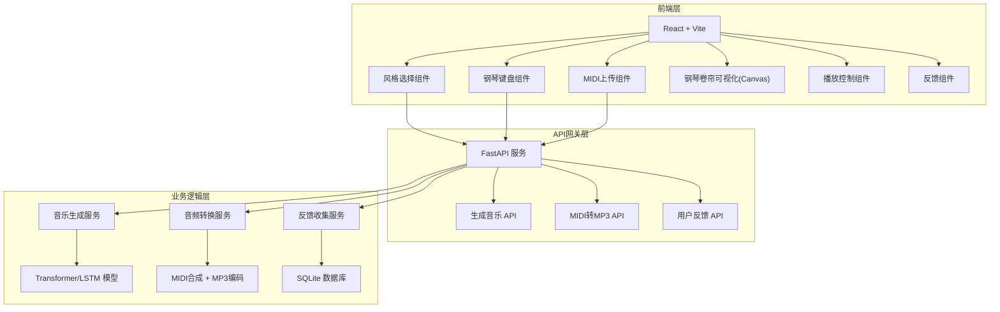
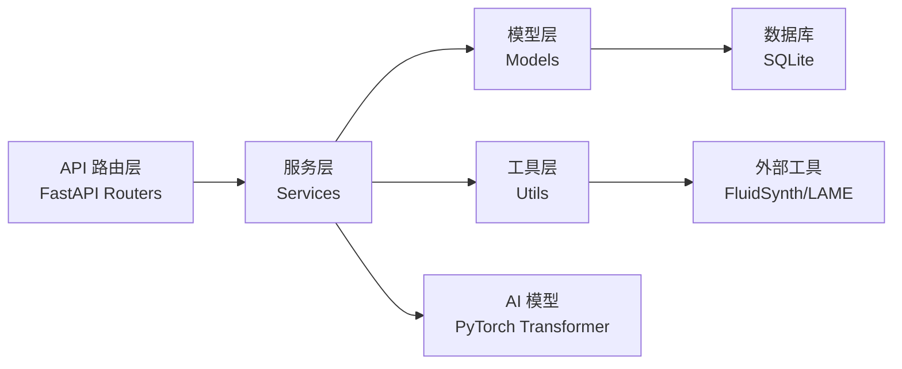
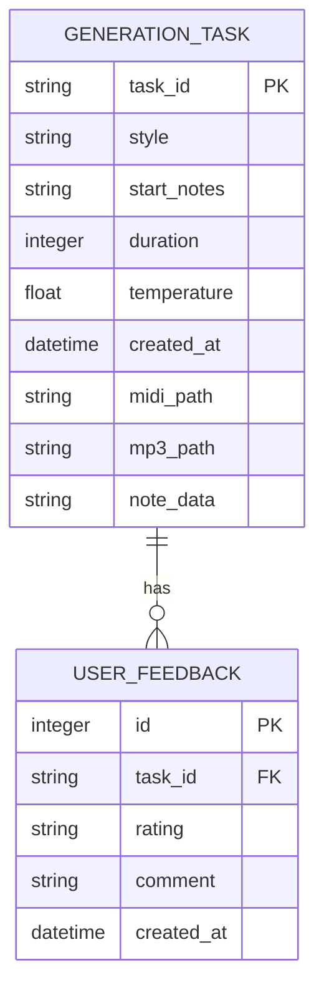

## 1. 架构设计



## 2. 技术描述

- **前端**：React@18 + TypeScript + Vite@5 + TailwindCSS@3
- **音频处理**：Web Audio API + Tone.js + WebMIDI.js
- **可视化**：Canvas API 自定义渲染
- **后端**：Python 3.10 + FastAPI@0.104
- **音乐生成**：PyTorch@2.1 + Transformers + MIDIUtils
- **音频转换**：midi2audio + FluidSynth + LAME MP3 encoder
- **数据库**：SQLite + SQLAlchemy
- **部署**：前后端分离，前端静态部署，后端 Uvicorn ASGI 服务器

## 3. 路由定义

| 路由 | 方法 | 用途 |
|------|------|------|
| / | GET | 前端主页面 |
| /api/generate | POST | 生成音乐请求 |
| /api/convert/mp3 | POST | MIDI 转 MP3 |
| /api/feedback | POST | 提交用户反馈 |
| /api/download/{file_type}/{file_id} | GET | 下载 MIDI/MP3 文件 |

## 4. API 定义

```typescript
// 音乐生成请求
interface GenerateRequest {
  style: 'jazz' | 'classical' | 'electronic';
  startNotes: number[];  // MIDI 音符编号数组
  midiFile?: string;  // Base64 编码的 MIDI 文件
  duration: number;   // 30 秒固定
  temperature: number;  // 生成随机性 0.1-1.0
}

// 音乐生成响应
interface GenerateResponse {
  success: boolean;
  taskId: string;
  midiData: string;  // Base64 MIDI
  mp3Data: string;  // Base64 MP3
  notes: Note[];      // 音符数据用于可视化
  duration: number;
}

// 音符数据结构
interface Note {
  pitch: number;      // MIDI 音高 0-127
  start: number;     // 起始时间（秒）
  duration: number;  // 持续时间（秒）
  velocity: number; // 力度 0-127
}

// 用户反馈请求
interface FeedbackRequest {
  taskId: string;
  rating: 'like' | 'dislike';
  comment?: string;
}

// 通用响应
interface ApiResponse<T> {
  code: number;
  message: string;
  data: T;
}
```

## 5. 服务器架构图



### 目录结构

```
backend/
├── app/
│   ├── main.py              # FastAPI 入口
│   ├── api/
│   │   ├── __init__.py
│   │   ├── generate.py      # 生成音乐路由
│   │   ├── convert.py     # 转换路由
│   │   └── feedback.py    # 反馈路由
│   ├── services/
│   │   ├── music_generator.py  # 音乐生成服务
│   │   ├── audio_converter.py  # 音频转换服务
│   │   └── feedback_service.py # 反馈服务
│   ├── models/
│   │   ├── transformer.py     # Transformer 模型
│   │   └── lstm.py          # LSTM 模型
│   ├── db/
│   │   ├── database.py      # 数据库连接
│   │   └── schemas.py       # 数据模型
│   └── utils/
│       ├── midi_utils.py    # MIDI 处理工具
│       └── audio_utils.py   # 音频处理工具
├── models/
│   ├── jazz_model.pt
│   ├── classical_model.pt
│   └── electronic_model.pt
├── soundfonts/
│   └── default.sf2
├── temp/                     # 临时文件目录
└── requirements.txt
```

## 6. 数据模型

### 6.1 数据模型定义



### 6.2 数据定义语言

```sql
CREATE TABLE generation_task (
    task_id TEXT PRIMARY KEY,
    style TEXT NOT NULL,
    start_notes TEXT,
    duration INTEGER NOT NULL DEFAULT 30,
    temperature REAL NOT NULL DEFAULT 0.8,
    created_at DATETIME DEFAULT CURRENT_TIMESTAMP,
    midi_path TEXT,
    mp3_path TEXT,
    note_data TEXT
);

CREATE TABLE user_feedback (
    id INTEGER PRIMARY KEY AUTOINCREMENT,
    task_id TEXT NOT NULL,
    rating TEXT NOT NULL,
    comment TEXT,
    created_at DATETIME DEFAULT CURRENT_TIMESTAMP,
    FOREIGN KEY (task_id) REFERENCES generation_task(task_id)
);

CREATE INDEX idx_feedback_task_id ON user_feedback(task_id);
CREATE INDEX idx_feedback_rating ON user_feedback(rating);
```

## 7. 前端项目结构

```
frontend/
├── src/
│   ├── components/
│   │   ├── StyleSelector.tsx      # 风格选择器
│   │   ├── PianoKeyboard.tsx      # 钢琴键盘
│   │   ├── MidiUploader.tsx     # MIDI 上传
│   │   ├── PianoRoll.tsx        # 钢琴卷帘
│   │   ├── PlaybackControls.tsx # 播放控制
│   │   └── FeedbackButtons.tsx      # 反馈按钮
│   ├── hooks/
│   │   ├── useAudioPlayer.ts     # 音频播放 Hook
│   │   └── useMidiPlayer.ts      # MIDI 播放 Hook
│   ├── services/
│   │   └── api.ts               # API 调用
│   ├── types/
│   │   └── index.ts             # 类型定义
│   ├── utils/
│   │   ├── midiParser.ts          # MIDI 解析
│   │   └── audioUtils.ts        # 音频工具
│   ├── App.tsx
│   ├── main.tsx
│   └── index.css
├── package.json
├── tsconfig.json
├── vite.config.ts
└── tailwind.config.js
```
