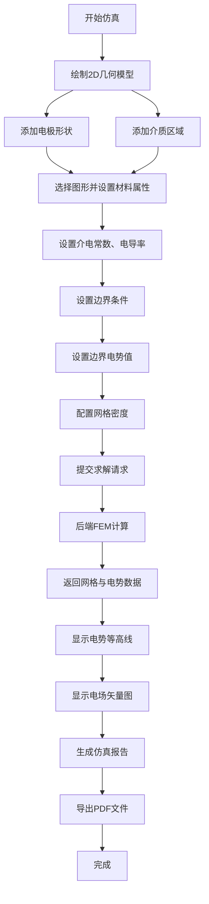

## 1. 产品概述

电磁场有限元仿真系统是一款面向科研人员和工程师的CAE仿真工具。用户可通过前端界面绘制2D几何模型（电极、介质），设置材料属性，后端采用有限元法求解电场分布，最终以可视化方式呈现电势等高线和电场矢量图，并支持导出PDF仿真报告。

- **核心价值**：将复杂的电磁场仿真计算简化为直观的图形化操作，降低有限元分析的技术门槛
- **目标用户**：电子工程、电磁场与微波技术、应用物理等领域的科研人员与工程师
- **市场定位**：轻量级、Web化的电磁场仿真工具，可用于教学演示和快速设计验证

## 2. 核心功能

### 2.1 功能模块

1. **几何建模模块**：支持绘制矩形、圆形、多边形等基础几何形状，定义电极区域和介质区域
2. **材料属性模块**：为不同区域设置介电常数、电导率等材料参数
3. **边界条件模块**：设置 Dirichlet 边界（固定电势）和 Neumann 边界条件
4. **有限元求解模块**：后端基于 scipy 实现有限元离散与线性方程组求解
5. **结果可视化模块**：绘制有限元网格、电势等高线、电场矢量箭头图
6. **报告导出模块**：生成并导出包含模型、参数、结果的PDF仿真报告

### 2.2 页面详情

| 页面名称 | 模块名称 | 功能描述 |
|---------|---------|---------|
| 主仿真工作台 | 几何绘制区 | Canvas画布，支持鼠标绘制电极和介质几何形状 |
| 主仿真工作台 | 工具栏 | 提供选择、绘制矩形、绘制圆形、绘制多边形、删除等工具 |
| 主仿真工作台 | 属性面板 | 显示选中图形的属性，编辑材料参数（介电常数、电导率） |
| 主仿真工作台 | 边界条件设置 | 设置各边界的电势值或边界类型 |
| 主仿真工作台 | 求解控制区 | 网格密度设置、求解按钮、计算进度显示 |
| 主仿真工作台 | 结果可视化区 | 切换显示网格、电势等高线、电场矢量图 |
| 主仿真工作台 | 报告导出区 | 预览仿真报告，导出为PDF文件 |

## 3. 核心流程

用户从绘制几何模型开始，依次完成材料赋值、边界条件设置，提交求解任务，待后端计算完成后查看可视化结果，最后导出仿真报告。

## 4. 用户界面设计

### 4.1 设计风格

- **主色调**：深蓝色系（#0F172A 背景，#3B82F6 主题色），体现科技感和专业性
- **辅助色**：青绿色（#06B6D4）用于高亮选中，橙色（#F97316）用于警示和操作提示
- **中性色**：不同深度的灰色用于文本层级，白色用于重要信息
- **按钮风格**：直角或微圆角（4px），带有微妙的悬停过渡效果
- **字体**：显示字体使用 Orbitron（科技感无衬线字体），正文字体使用 JetBrains Mono（等宽字体，数据显示清晰）
- **布局风格**：三栏布局 - 左侧工具栏 + 中央画布区 + 右侧属性/控制面板
- **视觉效果**：暗色主题，带有细微的网格背景和辉光效果，营造科学计算软件的专业氛围

### 4.2 页面设计概述

| 页面名称 | 模块名称 | UI 元素 |
|---------|---------|---------|
| 主仿真工作台 | 顶部标题栏 | 项目名称、版本信息、帮助按钮 |
| 主仿真工作台 | 左侧工具栏 | 垂直排列的工具图标按钮，带有tooltip提示 |
| 主仿真工作台 | 中央画布 | 网格背景的Canvas，支持缩放和平移，坐标显示 |
| 主仿真工作台 | 右侧面板 | 分选项卡：属性设置、边界条件、求解控制、结果展示 |
| 主仿真工作台 | 底部状态栏 | 鼠标坐标、计算状态、网格单元数、自由度信息 |

### 4.3 交互细节

- **几何绘制**：点击工具后进入绘制模式，鼠标拖拽绘制形状，双击完成多边形绘制
- **图形选择**：单击选中图形，选中状态显示高亮边框，支持多选择
- **参数输入**：数值输入框带单位标注，支持实时验证
- **求解过程**：显示进度条和状态文字，求解中禁用操作按钮
- **可视化切换**：通过复选框切换显示/隐藏网格、等高线、矢量图
- **颜色映射**：电势使用蓝-白-红渐变色彩映射，显示颜色条图例

### 4.4 响应式设计

- **桌面端优先**：针对 1920×1080 及以上分辨率优化，三栏布局充分利用屏幕空间
- **平板适配**：1024~1440px 宽度时，右侧面板可折叠为抽屉式
- **移动兼容**：小屏幕下提示切换到桌面端以获得最佳体验
- **画布适配**：Canvas 区域始终保持正方形比例，自动适配可用空间
