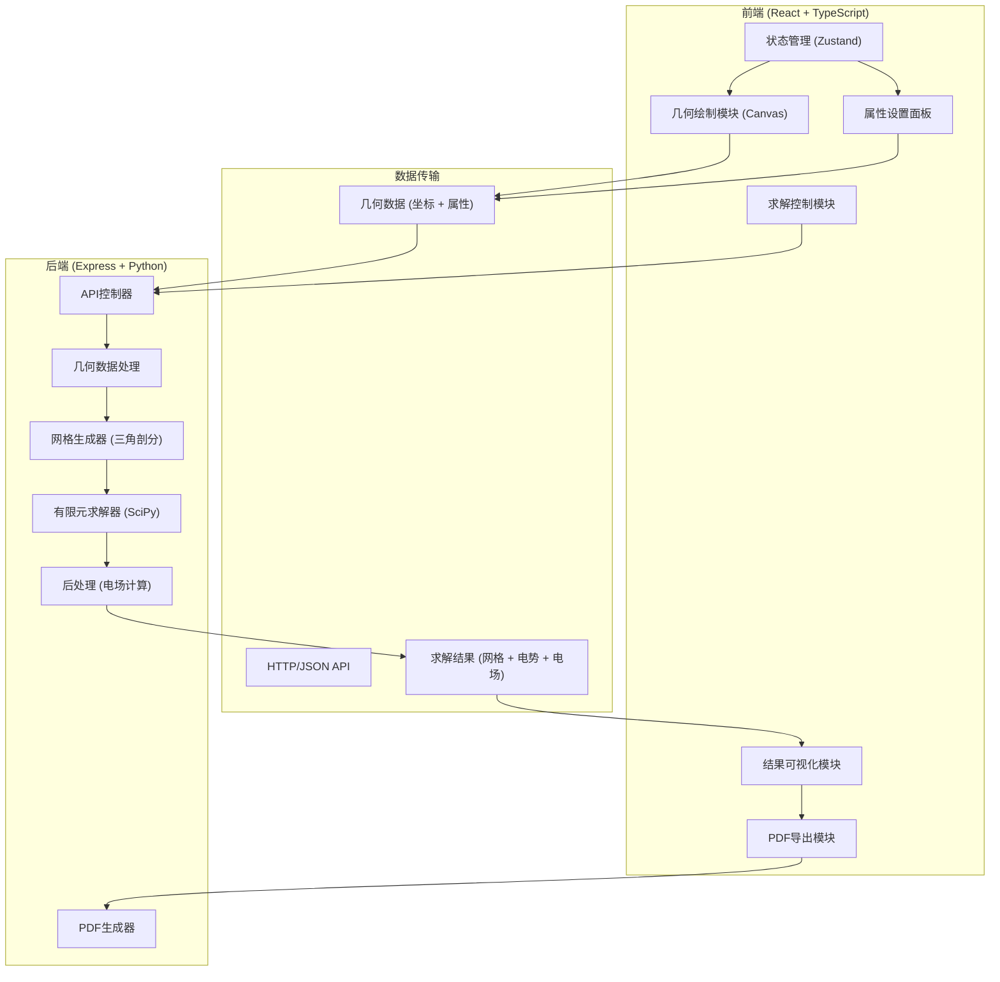
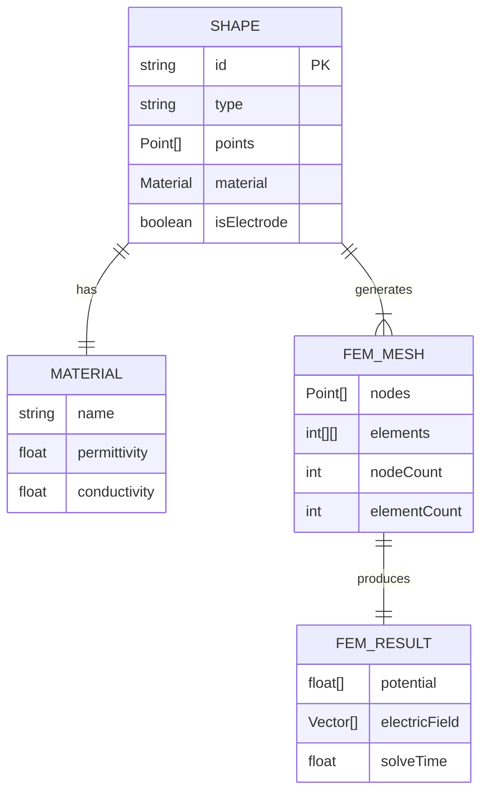
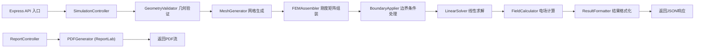

## 1. 架构设计

系统采用前后端分离架构。前端负责几何建模、交互操作和结果可视化，后端负责有限元求解计算。求解核心使用 Python + SciPy 实现，通过 Node.js 子进程调用。



## 2. 技术描述

### 2.1 前端技术栈
- **框架**：React 18 + TypeScript 5
- **构建工具**：Vite 5
- **样式**：Tailwind CSS 3
- **状态管理**：Zustand 4
- **图标**：Lucide React
- **几何绘制**：原生 HTML5 Canvas API
- **PDF导出**：jsPDF + html2canvas (前端备选)

### 2.2 后端技术栈
- **Web服务器**：Express 4 (Node.js)
- **求解核心**：Python 3.10+
- **科学计算库**：
  - NumPy（数值计算）
  - SciPy（稀疏矩阵、线性代数、三角剖分）
  - matplotlib（可选，辅助验证）
- **PDF生成**：ReportLab（后端方案）

### 2.3 求解算法
- **网格生成**：Delaunay 三角剖分（scipy.spatial.Delaunay）
- **有限元方法**：一阶三角形单元，刚度矩阵组装
- **边界条件**：Dirichlet（固定电势）罚函数法处理
- **线性求解**：稀疏矩阵求解（scipy.sparse.linalg.spsolve）
- **后处理**：由电势梯度计算电场强度 E = -∇V

## 3. 目录结构

```
project/
├── src/                           # 前端源码
│   ├── components/                # 组件目录
│   │   ├── canvas/               # Canvas相关组件
│   │   │   ├── GeometryCanvas.tsx
│   │   │   └── ResultCanvas.tsx
│   │   ├── toolbar/              # 工具栏组件
│   │   │   ├── Toolbar.tsx
│   │   │   └── ToolButton.tsx
│   │   ├── panels/               # 右侧面板组件
│   │   │   ├── PropertyPanel.tsx
│   │   │   ├── BoundaryPanel.tsx
│   │   │   ├── SolverPanel.tsx
│   │   │   └── ResultPanel.tsx
│   │   └── common/               # 通用组件
│   │       ├── Tabs.tsx
│   │       └── StatusBar.tsx
│   ├── hooks/                     # 自定义Hooks
│   │   ├── useCanvas.ts
│   │   └── useGeometry.ts
│   ├── store/                     # 状态管理
│   │   └── useSimulationStore.ts
│   ├── types/                     # TypeScript类型定义
│   │   └── index.ts
│   ├── utils/                     # 工具函数
│   │   ├── geometry.ts
│   │   └── visualization.ts
│   ├── pages/                     # 页面
│   │   └── SimulationPage.tsx
│   ├── App.tsx
│   └── main.tsx
├── api/                           # 后端源码
│   ├── index.ts                  # Express入口
│   ├── routes/
│   │   └── simulation.ts         # 仿真API路由
│   ├── controllers/
│   │   └── simulationController.ts
│   └── python/                   # Python求解器
│       ├── solver.py             # 有限元求解主程序
│       ├── mesh.py               # 网格生成
│       ├── fem.py                # 有限元组装
│       └── utils.py              # 工具函数
├── shared/                        # 共享类型
│   └── types.ts
└── public/
```

## 4. 路由定义

| 路由 | 页面/方法 | 目的 |
|-----|----------|------|
| `/` | SimulationPage | 主仿真工作台页面 |
| POST `/api/simulation/solve` | solve() | 提交仿真任务，返回求解结果 |
| POST `/api/simulation/report` | generateReport() | 生成并返回PDF报告 |
| GET `/api/health` | health() | 健康检查 |

## 5. API 定义

### 5.1 共享类型定义

```typescript
// 几何形状类型
export type ShapeType = 'rectangle' | 'circle' | 'polygon' | 'electrode' | 'dielectric';

export interface Point {
  x: number;
  y: number;
}

export interface Shape {
  id: string;
  type: ShapeType;
  name: string;
  points: Point[];        // 多边形顶点，矩形用两个对角点，圆用圆心+半径
  radius?: number;        // 圆形专用
  material: Material;
  isElectrode: boolean;
  boundaryCondition?: BoundaryCondition;
}

export interface Material {
  name: string;
  permittivity: number;    // 相对介电常数 εr
  conductivity: number;    // 电导率 σ (S/m)
}

export interface BoundaryCondition {
  type: 'dirichlet' | 'neumann';
  value: number;           // 电势值 (V) 或 电场法向分量
}

export interface SolverConfig {
  meshDensity: number;     // 网格密度控制参数
  domainSize: { width: number; height: number };
}

// 求解请求
export interface SolveRequest {
  shapes: Shape[];
  boundaryConditions: BoundaryCondition[];
  config: SolverConfig;
}

// 求解结果
export interface FEMResult {
  nodes: Point[];                  // 节点坐标
  elements: number[][];            // 单元节点索引 (三角形的三个顶点)
  potential: number[];             // 各节点电势值
  electricField: { x: number; y: number }[];  // 各节点电场矢量
  meshStats: {
    nodeCount: number;
    elementCount: number;
  };
  solveTime: number;               // 求解耗时(ms)
}

// 报告请求
export interface ReportRequest {
  simulation: SolveRequest;
  result: FEMResult;
  title: string;
  author?: string;
}
```

### 5.2 API 接口

#### POST `/api/simulation/solve`
**请求体**：`SolveRequest`

**响应**：
```typescript
{
  success: boolean;
  data?: FEMResult;
  error?: string;
}
```

#### POST `/api/simulation/report`
**请求体**：`ReportRequest`

**响应**：PDF 文件流 (`application/pdf`)

## 6. 核心数据结构

### 6.1 有限元求解数据流程



### 6.2 状态管理 (Zustand)

```typescript
interface SimulationState {
  // 几何数据
  shapes: Shape[];
  selectedShapeId: string | null;
  
  // 工具状态
  activeTool: 'select' | 'rectangle' | 'circle' | 'polygon' | 'delete';
  
  // 求解配置
  solverConfig: SolverConfig;
  
  // 求解结果
  result: FEMResult | null;
  isSolving: boolean;
  solveError: string | null;
  
  // 可视化选项
  showGrid: boolean;
  showContours: boolean;
  showVectors: boolean;
  contourLevel: number;
  vectorScale: number;
}
```

## 7. 后端架构



### 7.1 Python 求解器核心流程

```python
# solver.py 主流程
def solve_electrostatic(shapes, config):
    # 1. 生成计算域和网格
    nodes, elements = generate_mesh(shapes, config)
    
    # 2. 为每个单元分配材料属性
    element_materials = assign_materials(nodes, elements, shapes)
    
    # 3. 组装刚度矩阵 K 和载荷向量 F
    K, F = assemble_system(nodes, elements, element_materials)
    
    # 4. 应用 Dirichlet 边界条件
    K, F = apply_dirichlet_bc(K, F, shapes, nodes)
    
    # 5. 求解线性方程组 KV = F
    potential = solve_linear_system(K, F)
    
    # 6. 计算电场 E = -∇V
    electric_field = compute_electric_field(nodes, elements, potential)
    
    return {
        'nodes': nodes,
        'elements': elements,
        'potential': potential,
        'electricField': electric_field
    }
```

## 8. 关键技术点

### 8.1 前端 Canvas 绘制
- 使用 `requestAnimationFrame` 实现流畅绘制
- 实现坐标变换（缩放、平移）
- 实现点选命中检测（点在多边形内算法）

### 8.2 等值线生成
- 使用 Marching Squares 算法生成等值线
- 基于电势数组和等高线值计算线段

### 8.3 有限元实现细节
- 一阶三角形单元的形函数和刚度矩阵解析积分
- 稀疏矩阵存储（CSR格式）提高计算效率
- 罚函数法处理 Dirichlet 边界条件
