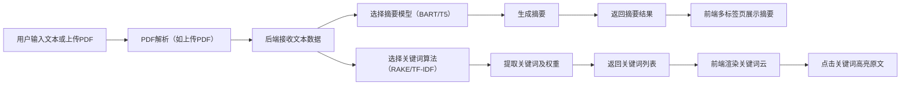

## 1. 产品概述

文本摘要与关键词提取系统，面向需要快速处理和分析长文档内容的用户群体（研究人员、学生、内容创作者）。通过集成NLP模型，自动化完成摘要生成和关键词提取，显著提升信息获取效率。

## 2. 核心功能

### 2.1 功能模块

1. **首页（主应用页）**：文本输入区、PDF上传区、模型选择器、结果展示区
2. **摘要对比区**：多标签页切换展示BART和T5模型的摘要结果
3. **关键词云区**：可视化展示提取的关键词及其权重
4. **原文浏览区**：带关键词高亮功能的原文展示

### 2.3 页面详情

| 页面名称 | 模块名称 | 功能描述 |
|-----------|-------------|---------------------|
| 主应用页 | 文本输入模块 | 支持直接粘贴长文本，实时字数统计 |
| 主应用页 | PDF上传模块 | 拖拽或点击上传PDF文件，自动解析文本内容 |
| 主应用页 | 模型选择模块 | 选择摘要模型（BART/T5）和关键词算法（RAKE/TF-IDF） |
| 主应用页 | 多标签摘要区 | 标签页切换对比不同模型的摘要结果 |
| 主应用页 | 关键词云模块 | 权重可视化，点击关键词可高亮原文对应位置 |
| 主应用页 | 原文高亮模块 | 原文展示，支持关键词高亮和滚动定位 |

## 3. 核心流程

## 4. 用户界面设计

### 4.1 设计风格
- **主色调**：深蓝色（#1e3a8a）作为主色，搭配科技感青色（#06b6d4）作为强调色
- **背景**：深色渐变背景配合细微噪点纹理，营造专业数据分析氛围
- **字体**：标题使用 Space Grotesk，正文使用 Inter，代码/等宽文本使用 JetBrains Mono
- **按钮风格**：微渐变填充，圆角8px，hover时有微妙的光晕效果
- **卡片风格**：半透明玻璃态（glassmorphism），模糊背景，细边框
- **图标风格**：使用 Phosphor Icons 线性图标

### 4.2 页面设计概览

| 页面名称 | 模块名称 | UI 元素 |
|-----------|-------------|-------------|
| 主应用页 | 输入区 | 大面积文本框，拖拽上传区域，文件选择按钮 |
| 主应用页 | 模型选择器 | 胶囊状切换按钮，下拉选择框 |
| 主应用页 | 摘要标签页 | 标签头部带模型名称和状态指示，切换有过渡动画 |
| 主应用页 | 关键词云 | 不同大小和颜色的关键词，hover放大效果 |
| 主应用页 | 原文展示区 | 可滚动区域，高亮标记有淡入动画 |

### 4.3 动效设计
- 页面加载：元素依次淡入，带有轻微的垂直位移
- 标签切换：内容区域平滑淡入淡出
- 关键词高亮：被点击的关键词在原文中有滚动定位和脉冲高亮效果
- 按钮交互：hover时背景色渐变过渡，点击时缩放反馈

### 4.4 响应式
- 桌面端为主设计，适配1280px及以上
- 平板端：布局两列变单列，输入区和结果区上下排列
- 移动端：简化操作，只保留核心功能，标签页改为底部切换

### 4.5 视觉层次
- 输入区和结果区采用左右分栏布局，黄金比例分割
- 摘要标签页位于右上区域，为视觉焦点
- 关键词云位于左下，原文展示位于右下
- 使用微妙的阴影和透明度差异创建深度感
