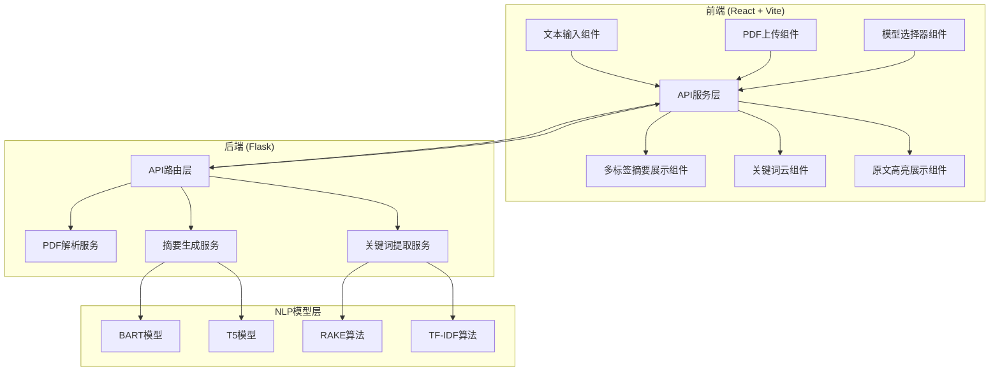
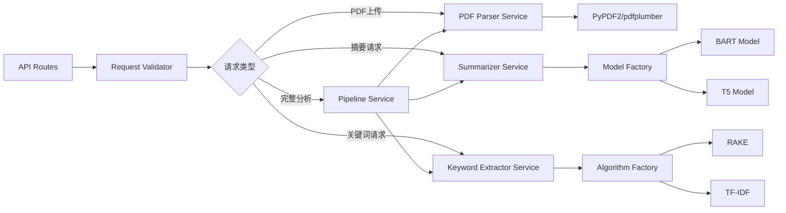
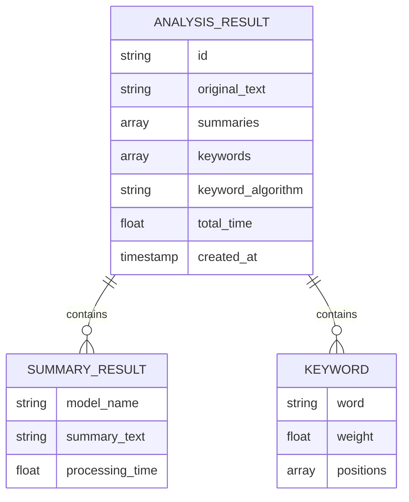

## 1. 架构设计



## 2. 技术描述

- **前端**：React 18 + TypeScript + Vite + TailwindCSS 3
- **UI组件**：自定义组件 + Phosphor Icons
- **后端**：Flask 3.x + Python 3.10+
- **PDF解析**：PyPDF2 + pdfplumber
- **NLP模型**：HuggingFace Transformers (BART、T5)
- **关键词提取**：RAKE + scikit-learn (TF-IDF)
- **关键词云**：react-d3-cloud
- **HTTP通信**：Axios

## 3. 目录结构

```
project/
├── frontend/
│   ├── src/
│   │   ├── components/
│   │   │   ├── TextInput.tsx
│   │   │   ├── PDFUpload.tsx
│   │   │   ├── ModelSelector.tsx
│   │   │   ├── SummaryTabs.tsx
│   │   │   ├── KeywordCloud.tsx
│   │   │   └── HighlightedText.tsx
│   │   ├── services/
│   │   │   └── api.ts
│   │   ├── types/
│   │   │   └── index.ts
│   │   ├── App.tsx
│   │   ├── main.tsx
│   │   └── index.css
│   ├── package.json
│   └── vite.config.ts
├── backend/
│   ├── app/
│   │   ├── __init__.py
│   │   ├── routes.py
│   │   ├── services/
│   │   │   ├── pdf_parser.py
│   │   │   ├── summarizer.py
│   │   │   └── keyword_extractor.py
│   │   └── utils/
│   │       └── text_processor.py
│   ├── requirements.txt
│   └── run.py
└── README.md
```

## 4. 路由定义

| 路由 | 用途 |
|-------|---------|
| / | 主应用页面 |
| /api/upload | PDF上传与解析 |
| /api/summarize | 文本摘要生成 |
| /api/keywords | 关键词提取 |
| /api/analyze | 完整分析（摘要+关键词） |

## 5. API 定义

```typescript
// 请求类型
interface AnalyzeRequest {
  text?: string;
  file?: File;
  summaryModels: ('bart' | 't5')[];
  keywordAlgorithm: 'rake' | 'tfidf';
  summaryLength?: 'short' | 'medium' | 'long';
  maxKeywords?: number;
}

// 响应类型
interface AnalyzeResponse {
  success: boolean;
  originalText: string;
  summaries: {
    model: string;
    summary: string;
    processingTime: number;
  }[];
  keywords: {
    word: string;
    weight: number;
    positions: { start: number; end: number }[];
  }[];
  algorithm: string;
  totalProcessingTime: number;
}

interface PDFParseResponse {
  success: boolean;
  text: string;
  pageCount: number;
  fileName: string;
}
```

## 6. 后端服务架构



## 7. 数据模型

### 7.1 关键词数据结构



## 8. 核心算法说明

### 8.1 摘要生成
- **BART**：facebook/bart-large-cnn，适合新闻类文本摘要
- **T5**：t5-small/t5-base，支持"summarize: "前缀提示
- 支持自定义摘要长度（短/中/长）

### 8.2 关键词提取
- **RAKE**：基于词共现的快速关键词提取，无需训练
- **TF-IDF**：基于词频-逆文档频率，适合有语料库的场景
- 返回关键词在原文中的位置索引，用于前端高亮

### 8.3 PDF解析
- 使用 pdfplumber 处理扫描质量高的PDF
- 备用 PyPDF2 处理兼容性问题
- 自动去除页眉页脚和多余空白
