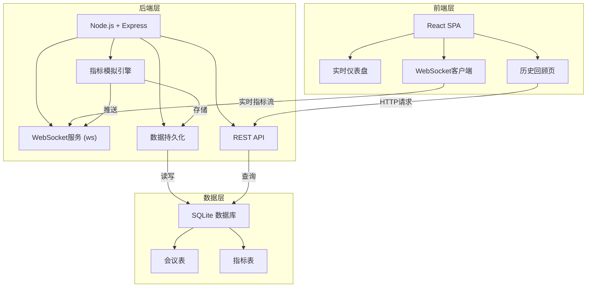
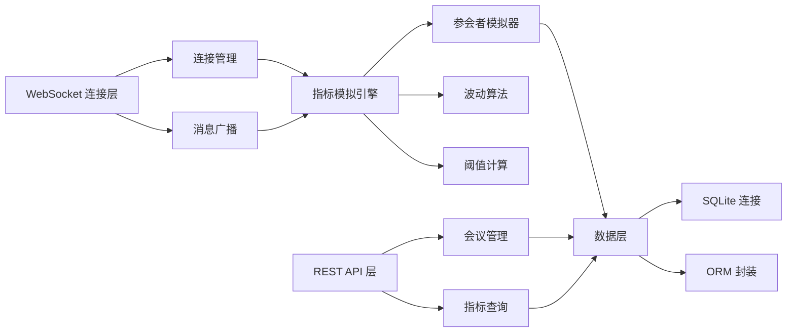
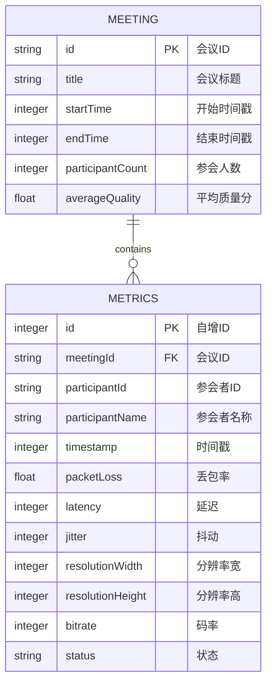

## 1. 架构设计

本系统采用前后端分离架构，后端负责 WebRTC 指标采集、模拟、存储和 WebSocket 推送，前端负责实时可视化展示和历史数据回顾。



## 2. 技术描述

- **前端**：React@18 + TypeScript + Vite + TailwindCSS@3 + React Router@6
- **初始化工具**：Vite
- **后端**：Node.js + Express@4 + ws (WebSocket) + better-sqlite3
- **数据库**：SQLite（轻量级，无需额外服务，便于本地运行）
- **图表库**：自定义 SVG 仪表盘 + Recharts（趋势图）
- **状态管理**：React Hooks (useState, useEffect, useContext)

## 3. 路由定义

### 前端路由

| 路由 | 页面 | 说明 |
|------|------|------|
| / | 实时监控页 | 默认首页，显示参会者仪表盘 |
| /history | 历史回顾页 | 会议列表和详情 |

### 后端 API 路由

| 方法 | 路由 | 用途 |
|------|------|------|
| GET | /api/meetings | 获取历史会议列表 |
| GET | /api/meetings/:id | 获取指定会议详情 |
| GET | /api/meetings/:id/metrics | 获取会议的指标历史数据 |
| GET | /api/health | 健康检查 |
| WS | /ws | WebSocket 实时指标推送 |

## 4. API 定义

### TypeScript 类型定义

```typescript
// WebRTC 指标数据
interface WebRtcMetrics {
  participantId: string;
  participantName: string;
  timestamp: number;
  packetLoss: number;      // 丢包率 0-100%
  latency: number;          // 延迟 ms
  jitter: number;           // 抖动 ms
  resolution: {             // 分辨率
    width: number;
    height: number;
  };
  bitrate: number;          // 码率 kbps
  status: 'good' | 'warning' | 'critical';
}

// 会议信息
interface Meeting {
  id: string;
  title: string;
  startTime: number;
  endTime?: number;
  participantCount: number;
  averageQuality: number;   // 0-100
}

// 阈值配置
interface ThresholdConfig {
  packetLoss: { warning: number; critical: number };
  latency: { warning: number; critical: number };
  jitter: { warning: number; critical: number };
  resolution: { warning: number; critical: number };
}
```

### WebSocket 消息格式

```typescript
// 服务端 -> 客户端
interface WsMessage {
  type: 'metrics' | 'participantJoined' | 'participantLeft' | 'meetingStarted' | 'meetingEnded';
  data: any;
  timestamp: number;
}
```

## 5. 服务器架构图



## 6. 数据模型

### 6.1 数据模型定义



### 6.2 DDL 语句

```sql
-- 会议表
CREATE TABLE IF NOT EXISTS meetings (
  id TEXT PRIMARY KEY,
  title TEXT NOT NULL,
  startTime INTEGER NOT NULL,
  endTime INTEGER,
  participantCount INTEGER NOT NULL DEFAULT 0,
  averageQuality REAL DEFAULT 0
);

-- 指标表
CREATE TABLE IF NOT EXISTS metrics (
  id INTEGER PRIMARY KEY AUTOINCREMENT,
  meetingId TEXT NOT NULL,
  participantId TEXT NOT NULL,
  participantName TEXT NOT NULL,
  timestamp INTEGER NOT NULL,
  packetLoss REAL NOT NULL DEFAULT 0,
  latency INTEGER NOT NULL DEFAULT 0,
  jitter INTEGER NOT NULL DEFAULT 0,
  resolutionWidth INTEGER NOT NULL DEFAULT 0,
  resolutionHeight INTEGER NOT NULL DEFAULT 0,
  bitrate INTEGER NOT NULL DEFAULT 0,
  status TEXT NOT NULL DEFAULT 'good',
  FOREIGN KEY (meetingId) REFERENCES meetings(id)
);

-- 索引
CREATE INDEX IF NOT EXISTS idx_metrics_meeting ON metrics(meetingId);
CREATE INDEX IF NOT EXISTS idx_metrics_participant ON metrics(participantId);
CREATE INDEX IF NOT EXISTS idx_metrics_timestamp ON metrics(timestamp);
```

### 阈值配置（默认）

```javascript
const DEFAULT_THRESHOLDS = {
  packetLoss: { warning: 2, critical: 5 },      // %
  latency: { warning: 150, critical: 300 },     // ms
  jitter: { warning: 30, critical: 60 },        // ms
  resolution: { warning: 720, critical: 480 }   // height px
};
```
