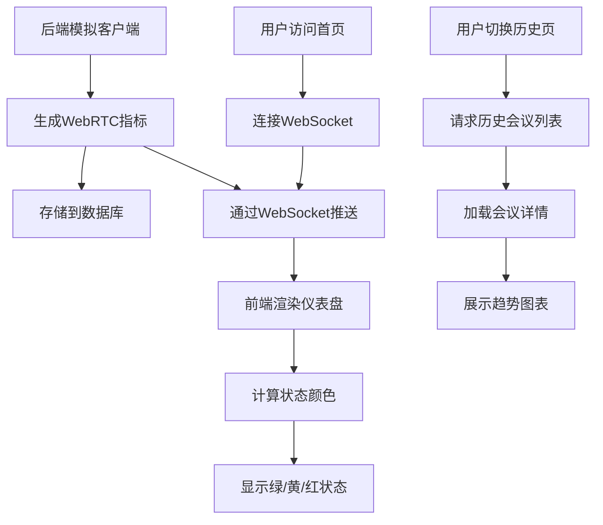

## 1. 产品概述

WebRTC 会议质量监控系统是一款实时网络会议质量监测工具，用于监控视频会议中每个参会者的网络质量指标（丢包率、延迟、抖动、分辨率），通过直观的仪表盘和颜色状态指示器帮助运维人员快速识别和定位网络问题。

- **核心用途**：实时监控 WebRTC 会议的网络质量，预警潜在的网络问题，支持历史会议质量回溯分析
- **目标用户**：企业 IT 运维团队、视频会议管理员、技术支持人员
- **产品价值**：减少会议故障排查时间，提升远程协作效率，优化网络资源配置

## 2. 核心功能

### 2.1 用户角色

| 角色 | 注册方式 | 核心权限 |
|------|---------|----------|
| 管理员 | 默认内置账号 | 查看实时监控、历史会议回顾、系统配置 |
| 普通用户 | 无需登录 | 仅查看实时监控仪表盘 |

### 2.2 功能模块

1. **实时监控仪表盘**：参会者卡片列表、实时指标仪表盘、整体状态概览
2. **历史会议回顾**：会议列表、会议详情回放、指标趋势图
3. **模拟客户端**：多参会者指标模拟、可配置的网络波动参数
4. **状态告警系统**：绿/黄/红三色状态指示、阈值告警

### 2.3 页面详情

| 页面名称 | 模块名称 | 功能描述 |
|---------|---------|----------|
| 实时监控页 | 顶部导航栏 | 系统标题、当前会议信息、切换到历史回顾 |
| 实时监控页 | 会议概览卡片 | 参会人数、平均质量评分、运行时长 |
| 实时监控页 | 参会者卡片网格 | 每个参会者的独立卡片，显示头像、名称、状态色、四个指标仪表盘 |
| 实时监控页 | 模拟控制面板 | 参会者数量控制、网络波动强度、开始/停止模拟 |
| 历史回顾页 | 历史会议列表 | 会议ID、开始时间、时长、参会人数、平均质量 |
| 历史回顾页 | 会议详情面板 | 选中会议的时间轴、参会者指标趋势折线图 |

## 3. 核心流程

用户进入系统首页，自动连接后端 WebSocket 服务。后端启动模拟客户端生成 WebRTC 指标数据，实时推送到前端。前端渲染参会者卡片，根据指标阈值显示绿/黄/红状态。用户可切换到历史回顾页面，查看已结束的会议记录和指标趋势图。

## 4. 用户界面设计

### 4.1 设计风格

- **主色调**：深空蓝 (#0F172A) 作为背景主色，营造科技感仪表盘氛围
- **状态色**：绿色 (#10B981) 正常、黄色 (#F59E0B) 警告、红色 (#EF4444) 严重
- **辅助色**：青色 (#06B6D4) 用于高亮、紫色 (#8B5CF6) 用于趋势线
- **按钮风格**：圆角 8px，轻微悬浮效果，点击有按压反馈
- **字体**：展示字体用 Orbitron（科技感数字字体），正文字体用 JetBrains Mono（等宽清晰）
- **布局风格**：深色仪表盘风格，卡片式网格布局，带有微妙的霓虹发光效果
- **图标风格**：线性图标，配合状态色使用

### 4.2 页面设计概述

| 页面名称 | 模块名称 | UI 元素 |
|---------|---------|---------|
| 实时监控页 | 顶部导航 | 深色渐变背景、发光标题、状态切换按钮 |
| 实时监控页 | 概览卡片 | 玻璃拟态效果、大数字动画计数、状态图标 |
| 实时监控页 | 参会者卡片 | 圆角卡片、阴影效果、状态色边框、SVG 仪表盘、微动画 |
| 实时监控页 | 控制面板 | 滑块控件、开关按钮、参数输入框 |
| 历史回顾页 | 会议列表 | 斑马纹表格、悬停高亮、状态标签 |
| 历史回顾页 | 趋势图表 | SVG 折线图、渐变填充、时间轴刻度 |

### 4.3 响应性

- 桌面端优先设计，参会者卡片自适应网格布局（2-4列）
- 平板端 1-2 列布局，缩小仪表盘尺寸
- 移动端单列堆叠，优化触控区域大小
- 所有交互元素支持键盘导航和屏幕阅读器

### 4.4 视觉特效

- 仪表盘指针带有平滑过渡动画
- 状态切换时卡片边框有发光脉冲效果
- 数据更新时数字有滚动计数动画
- 背景有微妙的网格纹理和径向渐变
- 红色告警状态时有呼吸灯效果
