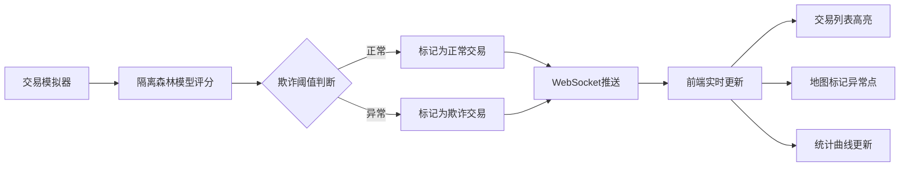

## 1. 产品概述

信用卡欺诈检测实时面板是一个金融风控监控系统，通过机器学习模型实时分析交易数据，自动识别并标记可疑欺诈交易，帮助风控团队快速响应异常交易活动。

- 主要目标：实时监控信用卡交易流，通过隔离森林模型自动检测欺诈行为
- 目标用户：金融风控团队、安全分析师、运营监控人员
- 产品价值：降低欺诈损失、提升风控响应速度、可视化展示异常交易分布

## 2. 核心功能

### 2.1 用户角色
| 角色 | 注册方式 | 核心权限 |
|------|---------|---------|
| 风控分析师 | 无需登录 | 查看实时交易监控、欺诈统计和地图分布 |

### 2.2 功能模块
1. **实时交易面板**：最近20笔交易列表、欺诈交易高亮标记
2. **地图监控**：异常交易地点标注、地理位置分布可视化
3. **统计仪表板**：欺诈检测率曲线、今日累计欺诈金额、关键指标展示
4. **实时推送**：WebSocket实时推送新交易数据

### 2.3 页面详情
| 页面名称 | 模块名称 | 功能描述 |
|---------|---------|----------|
| 实时监控面板 | 交易列表 | 展示最近20笔交易，包含金额、商户、位置信息，欺诈交易红色高亮 |
| 实时监控面板 | 统计卡片 | 展示今日交易总数、欺诈数量、检测率、累计欺诈金额 |
| 实时监控面板 | 趋势图表 | 欺诈检测率时间曲线，最近1小时数据 |
| 实时监控面板 | 地理位置地图 | 世界地图标注所有欺诈交易地点，点击显示详情 |

## 3. 核心流程

后端每秒生成10笔模拟交易，通过隔离森林模型进行欺诈评分，评分超过阈值的交易标记为欺诈。所有交易数据通过WebSocket推送到前端，前端实时更新交易列表、地图标记和统计图表。

## 4. 用户界面设计

### 4.1 设计风格
- **主色调**：深色科技风格，深蓝色背景（#0a0e17）配合警戒红色（#ef4444）和成功绿色（#10b981）
- **辅助色**：青色高亮（#06b6d4）用于数据可视化
- **字体**：使用JetBrains Mono等宽字体展示数据，Inter作为界面字体
- **布局**：卡片式网格布局，固定高度滚动容器
- **视觉风格**：赛博朋克/金融科技风格，带有霓虹发光效果、磨砂玻璃质感、数据扫描线条动画

### 4.2 页面设计概述
| 页面名称 | 模块名称 | UI元素 |
|---------|---------|--------|
| 实时监控面板 | 头部状态栏 | 系统状态指示灯、实时时间、连接状态、数据刷新率 |
| 实时监控面板 | 统计卡片 | 4个关键指标卡片，带渐变边框、数字滚动动画 |
| 实时监控面板 | 交易列表 | 表格布局，交替行背景，欺诈行红色闪烁动画 |
| 实时监控面板 | 趋势图表 | 平滑曲线图，实时数据点动画，渐变色填充 |
| 实时监控面板 | 世界地图 | SVG世界地图，欺诈点脉冲动画，悬浮弹窗详情 |

### 4.3 响应性
- 桌面端优先设计，采用CSS Grid自适应布局
- 中等屏幕：2x2网格布局统计卡片，左右分栏展示列表和图表
- 小屏幕：单列堆叠布局，地图自适应缩放
- 触控设备：增大点击区域，优化滚动体验

### 4.4 动画与交互
- 新交易进入：从左侧滑入+淡入动画
- 欺诈标记：红色边框脉冲动画，背景色呼吸效果
- 地图标记点：圆形向外扩散波纹动画
- 数字更新：数字滚动过渡效果
- 图表更新：平滑曲线过渡动画
- 鼠标悬停：卡片轻微上浮+阴影增强
