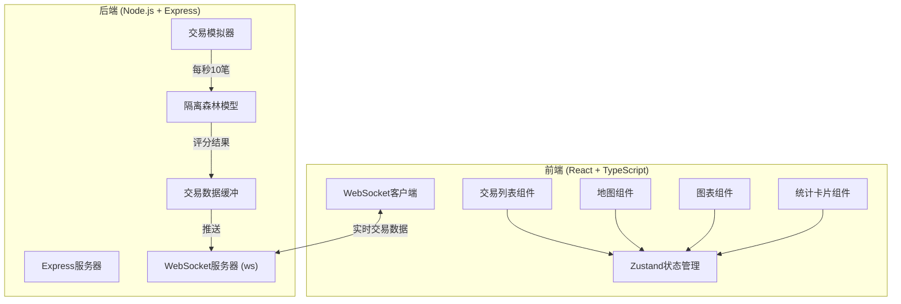
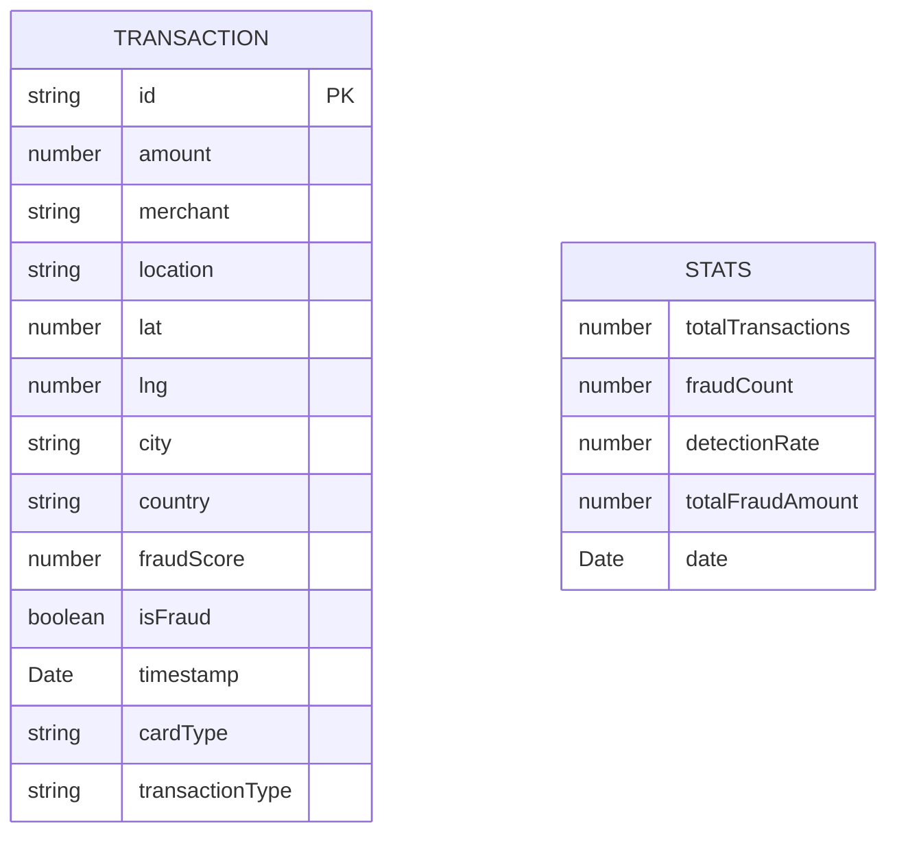

## 1. 架构设计



## 2. 技术描述

- **前端**：React@18 + TypeScript + Vite + TailwindCSS@3 + Zustand + Recharts
- **后端**：Express@4 + TypeScript + WebSocket (ws)
- **机器学习**：使用孤立森林算法（Isolation Forest）实现欺诈检测
- **地图**：使用D3.js + TopoJSON渲染世界地图
- **图标**：lucide-react
- **初始化工具**：vite-init

## 3. 目录结构

```
project/
├── src/
│   ├── components/
│   │   ├── TransactionList.tsx    # 交易列表组件
│   │   ├── FraudMap.tsx           # 地图组件
│   │   ├── StatsCard.tsx          # 统计卡片
│   │   ├── DetectionChart.tsx     # 检测率曲线
│   │   └── Header.tsx             # 头部状态栏
│   ├── hooks/
│   │   └── useWebSocket.ts        # WebSocket hook
│   ├── store/
│   │   └── useTransactionStore.ts # 状态管理
│   ├── types/
│   │   └── index.ts               # 类型定义
│   ├── utils/
│   │   └── formatters.ts          # 格式化工具
│   ├── App.tsx
│   ├── main.tsx
│   └── index.css
├── api/
│   ├── server.ts                  # Express服务器入口
│   ├── services/
│   │   ├── TransactionSimulator.ts # 交易模拟器
│   │   └── IsolationForest.ts     # 隔离森林模型
│   ├── websocket/
│   │   └── WebSocketServer.ts     # WebSocket服务器
│   └── types/
│       └── index.ts               # 共享类型
├── shared/
│   └── types.ts                   # 前后端共享类型
├── vite.config.ts
├── tsconfig.json
├── tailwind.config.js
└── package.json
```

## 4. 数据模型

### 4.1 交易数据模型



### 4.2 TypeScript 类型定义

```typescript
// shared/types.ts
export interface Transaction {
  id: string;
  amount: number;
  merchant: string;
  location: string;
  lat: number;
  lng: number;
  city: string;
  country: string;
  fraudScore: number;
  isFraud: boolean;
  timestamp: Date;
  cardType: string;
  transactionType: string;
}

export interface StatsData {
  totalTransactions: number;
  fraudCount: number;
  detectionRate: number;
  totalFraudAmount: number;
}

export interface DetectionRatePoint {
  time: string;
  rate: number;
  count: number;
}

export type WebSocketMessage = 
  | { type: 'transaction'; data: Transaction }
  | { type: 'stats'; data: StatsData }
  | { type: 'history'; data: Transaction[] }
  | { type: 'detectionRate'; data: DetectionRatePoint[] };
```

## 5. API 定义

### WebSocket API

| 消息类型 | 触发时机 | 数据结构 |
|---------|---------|---------|
| `transaction` | 新交易生成时 | `Transaction` |
| `stats` | 统计数据更新时（每5秒） | `StatsData` |
| `history` | 客户端连接时 | `Transaction[]` (最近20笔) |
| `detectionRate` | 检测率曲线更新（每10秒） | `DetectionRatePoint[]` |

## 6. 隔离森林算法实现

**核心原理**：孤立森林通过随机选择特征和随机分割特征值来孤立异常点。欺诈交易通常是少数且特征异于正常交易，因此路径长度更短。

**实现要点**：
- 使用iTree构建多棵孤立树（默认100棵）
- 每个样本子采样大小为256
- 计算路径长度得到异常分数
- 阈值设为0.6，分数>0.6标记为欺诈

**交易特征向量**：
1. 交易金额（对数归一化）
2. 交易时间偏差（与当前小时的偏差）
3. 地理位置偏离度（与常用位置的距离）
4. 商户风险等级
5. 交易频率
