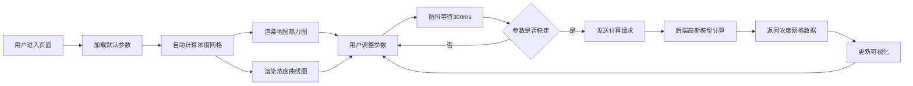

## 1. 产品概述

大气扩散模型模拟系统，用于模拟污染物在大气中的扩散过程。用户输入污染源参数（位置、排放速率、风速风向等），后端通过高斯烟羽模型计算污染物浓度分布，前端在地图上绘制等值线热力图，并展示下风向轴线上的浓度变化曲线。

- 主要用途：环境影响评估、应急响应决策支持、教育科研演示
- 目标用户：环境工程师、科研人员、学生、应急管理部门
- 产品价值：提供直观的污染物扩散可视化，帮助理解大气扩散规律

## 2. 核心功能

### 2.1 用户角色

| 角色 | 注册方式 | 核心权限 |
|------|----------|----------|
| 普通用户 | 无需注册 | 调整参数、查看模拟结果、导出图像 |

### 2.2 功能模块

1. **主页面**：参数控制面板、地图可视化区域、浓度曲线图
2. **参数输入模块**：污染源位置、排放速率、烟羽参数、气象参数
3. **地图可视化模块**：Leaflet地图、等值线热力图、污染源标记、风玫瑰指示器
4. **浓度曲线模块**：下风向轴线浓度变化曲线图
5. **实时计算模块**：参数防抖更新、异步计算、加载状态指示

### 2.3 页面详情

| 页面名称 | 模块名称 | 功能描述 |
|----------|----------|----------|
| 主页面 | 参数控制面板 | 污染源位置选择（经纬度/地图点击）、排放速率、烟羽高度、排放源半径 |
| 主页面 | 气象参数面板 | 风速、风向、大气稳定度、混合层高度 |
| 主页面 | 地图可视化区域 | Leaflet交互式地图、等值线热力图层、污染源标记、风羽指示器 |
| 主页面 | 浓度曲线图 | 下风向轴线浓度分布、峰值标注、浓度单位切换 |
| 主页面 | 计算控制区 | 手动计算/实时切换、计算进度指示、重置按钮 |

## 3. 核心流程

用户进入页面后，系统使用默认参数自动进行一次模拟计算并显示结果。用户可以调整各参数，系统通过防抖机制（300ms）在用户停止调整后自动触发重新计算，也可切换为手动计算模式。计算过程中显示加载状态，完成后更新地图热力图和浓度曲线。

## 4. 用户界面设计

### 4.1 设计风格

- **主色调**：深蓝科技风（#1e3a5f），搭配青绿色渐变（#0ea5e9 → #10b981）表示浓度从低到高
- **辅助色**：橙红色（#f97316）标记污染源和高浓度区域
- **背景**：深色模式，深灰蓝渐变背景（#0f172a → #1e293b）
- **按钮风格**：圆角8px，悬浮阴影，点击缩放效果
- **字体**：标题使用 Space Grotesk，正文使用 Inter，等宽数据显示使用 JetBrains Mono
- **布局风格**：三栏布局 - 左侧参数面板、中间地图区域、右侧曲线图区域
- **图标风格**：Lucide 线性图标，科技感简约风格

### 4.2 页面设计概述

| 页面名称 | 模块名称 | UI元素 |
|----------|----------|--------|
| 主页面 | 参数控制面板 | 分组卡片、滑块控件、数字输入框、下拉选择器、实时/手动切换开关 |
| 主页面 | 地图区域 | 全屏Leaflet地图、等值线热力图层、污染源标记、风羽指示器、图例说明 |
| 主页面 | 浓度曲线图 | Chart.js折线图、网格线、峰值标记、悬浮提示、坐标轴标签 |
| 主页面 | 顶部导航 | 系统标题、计算状态指示器、重置按钮、帮助按钮 |

### 4.3 响应性

- 桌面端：三栏固定布局，地图区域自适应
- 平板端：参数面板可折叠，上下布局（地图+曲线）
- 移动端：单列布局，参数面板抽屉式展开，支持触摸手势操作地图

### 4.4 交互细节

- 参数滑块拖动时实时显示数值
- 地图点击可设置污染源位置
- 热力图支持透明度调节
- 曲线图支持缩放和平移
- 计算过程中显示骨架屏加载动画
- 参数变更时有轻微高亮提示
