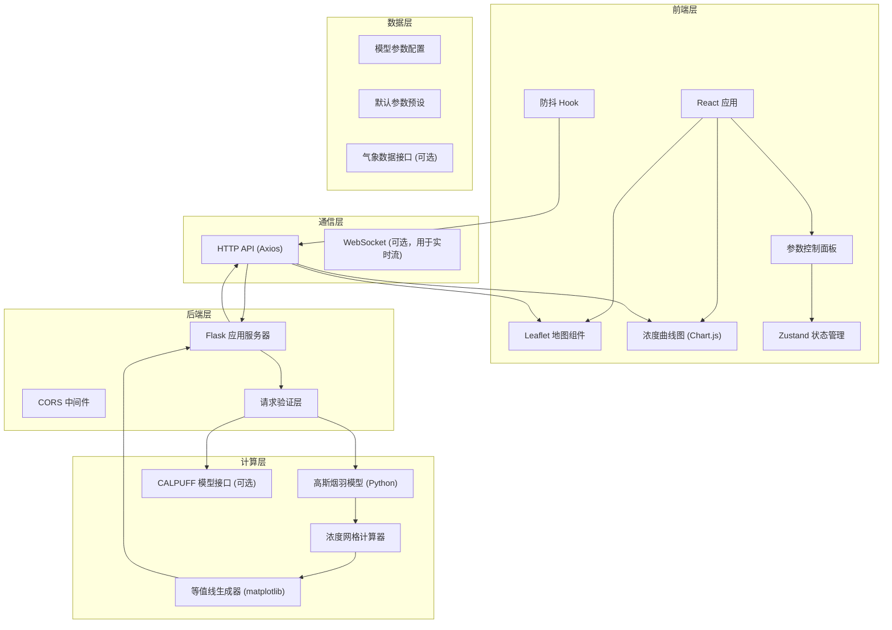
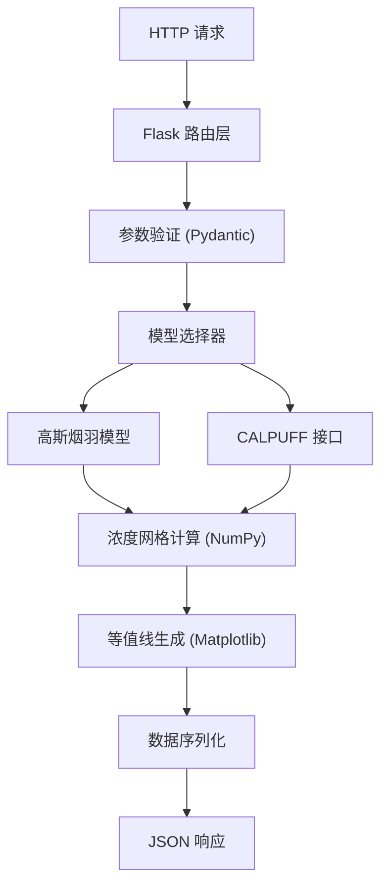
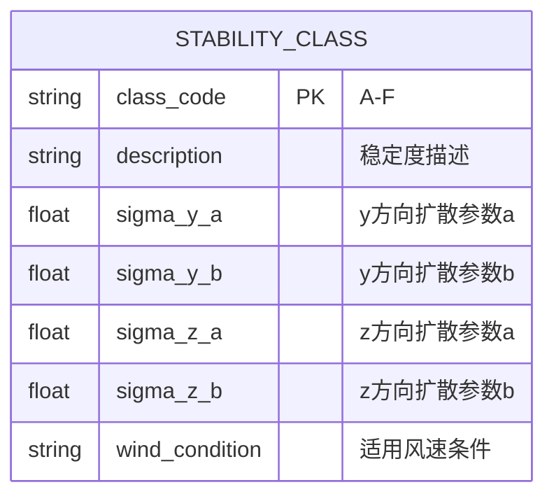

## 1. 架构设计



## 2. 技术描述

### 2.1 技术栈选择

| 层级 | 技术选型 | 版本 | 说明 |
|------|----------|------|------|
| 前端框架 | React | 18.x | 使用函数式组件 + Hooks |
| 构建工具 | Vite | 5.x | 快速开发与构建 |
| 编程语言 | TypeScript | 5.x | 类型安全 |
| 样式方案 | Tailwind CSS | 3.x | 原子化CSS |
| 状态管理 | Zustand | 4.x | 轻量状态管理 |
| 地图组件 | Leaflet | 1.9.x | 开源交互式地图 |
| 图表组件 | Chart.js | 4.x | 轻量级图表库 |
| HTTP客户端 | Axios | 1.x | 请求拦截与响应处理 |
| 图标库 | Lucide React | 0.x | 线性图标 |
| 后端框架 | Flask | 3.x | Python轻量Web框架 |
| 数值计算 | NumPy | 1.x | 高效数组运算 |
| 科学计算 | SciPy | 1.x | 高斯滤波与插值 |
| 可视化 | Matplotlib | 3.x | 等值线生成 |
| 并发处理 | Gunicorn | 21.x | 生产级WSGI服务器 |

### 2.2 关键设计决策

1. **前后端分离架构**：前端负责交互与可视化，后端专注于数值计算，职责清晰
2. **Python后端**：大气扩散模型需要大量科学计算，Python生态（NumPy/SciPy）提供强大支持
3. **高斯烟羽模型为主**：实现经典高斯烟羽模型，预留CALPUFF模型接口（可调用外部可执行文件）
4. **防抖计算**：前端使用300ms防抖，避免频繁参数调整导致的重复计算
5. **浓度网格计算**：后端生成等距网格浓度数据，前端用于绘制热力图和等值线
6. **地图坐标系**：使用WGS84坐标系，支持经纬度定位与距离换算

## 3. 路由定义

### 3.1 前端路由

| 路由 | 页面 | 说明 |
|------|------|------|
| / | 主页面 | 参数面板 + 地图 + 曲线图 |

### 3.2 后端API路由

| 方法 | 路由 | 说明 |
|------|------|------|
| GET | /api/health | 健康检查 |
| POST | /api/calculate | 计算浓度网格 |
| POST | /api/calculate-plume | 计算下风向轴线浓度 |
| GET | /api/default-params | 获取默认参数 |
| GET | /api/stability-classes | 获取大气稳定度分类参数 |

## 4. API 定义

### 4.1 TypeScript 类型定义

```typescript
// 污染源参数
interface SourceParams {
  longitude: number;      // 经度 (度)
  latitude: number;       // 纬度 (度)
  emissionRate: number;   // 排放速率 (g/s)
  stackHeight: number;    // 烟囱高度 (m)
  stackRadius: number;    // 烟囱出口半径 (m)
  exitVelocity: number;   // 烟气出口速度 (m/s)
  exitTemperature: number; // 烟气出口温度 (K)
}

// 气象参数
interface MeteorologyParams {
  windSpeed: number;      // 风速 (m/s)
  windDirection: number;  // 风向 (度，0=北，顺时针)
  stabilityClass: string; // 大气稳定度分类 (A-F)
  mixingHeight: number;   // 混合层高度 (m)
  ambientTemperature: number; // 环境温度 (K)
}

// 计算域参数
interface DomainParams {
  gridSize: number;       // 网格分辨率 (m)
  domainWidth: number;    // 计算域宽度 (m)
  domainHeight: number;   // 计算域高度 (m)
  downwindDistance: number; // 下风向最大距离 (m)
}

// 计算请求
interface CalculateRequest {
  source: SourceParams;
  meteorology: MeteorologyParams;
  domain: DomainParams;
  modelType: 'gaussian' | 'calpuff';
}

// 网格点
interface GridPoint {
  x: number;              // 相对x坐标 (m)
  y: number;              // 相对y坐标 (m)
  lon: number;            // 经度
  lat: number;            // 纬度
  concentration: number;  // 浓度 (μg/m³)
}

// 计算响应
interface CalculateResponse {
  grid: GridPoint[][];    // 2D浓度网格
  maxConcentration: number; // 最大浓度
  maxConcentrationPoint: { lon: number; lat: number };
  plumeLine: PlumePoint[]; // 下风向轴线数据
  contourData: ContourData; // 等值线数据
  statistics: {
    computationTime: number;
    gridPoints: number;
  };
}

// 下风向浓度点
interface PlumePoint {
  distance: number;       // 下风向距离 (m)
  concentration: number;  // 浓度 (μg/m³)
}

// 等值线数据
interface ContourData {
  levels: number[];       // 等值线级别
  paths: string[][];      // SVG路径数据
}
```

### 4.2 请求/响应示例

**POST /api/calculate**

Request:
```json
{
  "source": {
    "longitude": 116.3975,
    "latitude": 39.9087,
    "emissionRate": 100,
    "stackHeight": 100,
    "stackRadius": 2,
    "exitVelocity": 15,
    "exitTemperature": 393.15
  },
  "meteorology": {
    "windSpeed": 5,
    "windDirection": 180,
    "stabilityClass": "B",
    "mixingHeight": 1000,
    "ambientTemperature": 293.15
  },
  "domain": {
    "gridSize": 50,
    "domainWidth": 2000,
    "domainHeight": 2000,
    "downwindDistance": 5000
  },
  "modelType": "gaussian"
}
```

Response:
```json
{
  "grid": [[{"x": -1000, "y": -1000, "lon": 116.385, "lat": 39.899, "concentration": 0.001}]],
  "maxConcentration": 125.5,
  "maxConcentrationPoint": {"lon": 116.402, "lat": 39.905},
  "plumeLine": [{"distance": 0, "concentration": 0}],
  "contourData": {
    "levels": [0.1, 1, 5, 10, 25, 50, 100],
    "paths": [["M0,0 L10,10", "M20,20 L30,30"]]
  },
  "statistics": {
    "computationTime": 0.045,
    "gridPoints": 3201
  }
}
```

## 5. 服务器架构



## 6. 数据模型

### 6.1 大气稳定度分类参数



### 6.2 默认参数配置

```python
DEFAULT_PARAMS = {
    "source": {
        "longitude": 116.3975,    # 北京天安门
        "latitude": 39.9087,
        "emissionRate": 100,       # g/s
        "stackHeight": 100,        # m
        "stackRadius": 2,          # m
        "exitVelocity": 15,        # m/s
        "exitTemperature": 393.15  # K (120°C)
    },
    "meteorology": {
        "windSpeed": 5,            # m/s
        "windDirection": 180,      # 南风
        "stabilityClass": "B",     # 中性偏不稳定
        "mixingHeight": 1000,      # m
        "ambientTemperature": 293.15  # K (20°C)
    },
    "domain": {
        "gridSize": 50,            # m
        "domainWidth": 2000,       # m (左右各1000m)
        "domainHeight": 2000,      # m
        "downwindDistance": 5000   # m
    }
}
```

## 7. 核心算法 - 高斯烟羽模型

### 7.1 浓度计算公式

对于点源连续排放，地面浓度计算公式：

```
C(x, y, z) = (Q / (2πuσyσz)) * exp(-y²/(2σy²)) * [exp(-(z-H)²/(2σz²)) + exp(-(z+H)²/(2σz²))]
```

其中：
- C = 浓度 (g/m³)
- Q = 排放速率 (g/s)
- u = 烟囱出口处平均风速 (m/s)
- σy = y方向扩散参数 (m)
- σz = z方向扩散参数 (m)
- H = 有效源高 (m) = 烟囱几何高度 + 烟气抬升高度
- x = 下风向距离 (m)
- y = 横风向距离 (m)
- z = 离地高度 (m)

### 7.2 扩散参数 σy, σz

根据Pasquill-Gifford公式：
```
σy = a * x^b
σz = c * x^d
```
其中a, b, c, d根据大气稳定度分类(A-F)取不同值。

### 7.3 烟气抬升高度 (霍兰德公式)

```
Δh = (vs * d / u) * (1.5 + 2.68 * 10^-3 * P * d * (Ts - Ta) / Ts)
```
其中：
- vs = 烟气出口速度 (m/s)
- d = 烟囱出口直径 (m)
- u = 烟囱口处风速 (m/s)
- P = 大气压力 (kPa)
- Ts = 烟气出口温度 (K)
- Ta = 环境大气温度 (K)

## 8. 项目目录结构

```
project-root/
├── .trae/documents/           # 项目文档
├── api/                        # 后端代码
│   ├── app.py                  # Flask应用入口
│   ├── models/
│   │   ├── gaussian.py         # 高斯烟羽模型
│   │   ├── calpuff.py          # CALPUFF接口
│   │   └── stability.py        # 稳定度参数
│   ├── services/
│   │   ├── calculator.py       # 浓度计算服务
│   │   └── contour.py          # 等值线生成
│   ├── schemas/
│   │   └── models.py           # Pydantic数据模型
│   └── utils/
│       └── coordinates.py      # 坐标转换工具
├── src/                        # 前端代码
│   ├── components/
│   │   ├── ControlPanel/       # 参数控制面板
│   │   ├── MapView/            # Leaflet地图组件
│   │   ├── ConcentrationChart/ # 浓度曲线图
│   │   └── Header/             # 顶部导航
│   ├── store/
│   │   └── useSimulationStore.ts # 状态管理
│   ├── hooks/
│   │   ├── useDebounce.ts      # 防抖Hook
│   │   └── useMap.ts           # 地图Hook
│   ├── services/
│   │   └── api.ts              # API服务
│   ├── types/
│   │   └── index.ts            # 类型定义
│   └── utils/
│       └── coordinates.ts      # 坐标转换
├── public/                     # 静态资源
├── requirements.txt            # Python依赖
├── package.json                # Node依赖
└── vite.config.ts              # Vite配置
```
