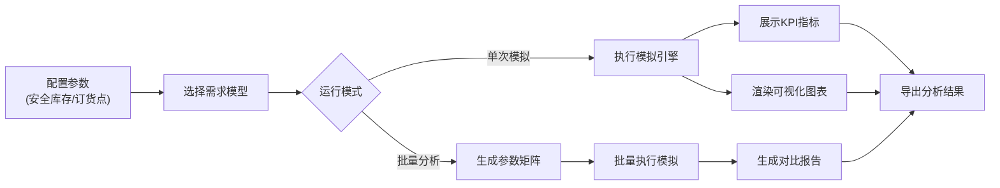

## 1. 产品概述

供应链库存优化模拟系统是一个面向供应链运营管理人员的决策支持工具，通过模拟多仓库网络、运输线路和动态需求，帮助用户优化安全库存水平和订货点策略，在降低库存成本的同时保障服务水平。

- 核心价值：通过量化模拟分析不同库存策略对库存周转率、缺货率和总成本的影响，支持数据驱动的库存决策
- 目标用户：供应链分析师、库存经理、运营优化专家

## 2. 核心功能

### 2.1 用户角色
| 角色 | 注册方式 | 核心权限 |
|------|----------|----------|
| 分析师 | 无需注册（单机应用） | 配置参数、运行模拟、查看分析结果、导出数据 |

### 2.2 功能模块
1. **主模拟面板**：参数配置、模拟运行控制、关键指标展示
2. **库存可视化**：各仓库库存水位动态柱状图、成本构成饼图
3. **敏感性分析**：批量参数组合配置、多场景结果对比

### 2.3 页面详情
| 页面名称 | 模块名称 | 功能描述 |
|----------|----------|----------|
| 主模拟面板 | 参数配置区 | 设置各仓库安全库存系数、订货点、补货提前期 |
| 主模拟面板 | 模拟控制区 | 选择需求预测模型、设置模拟周期、启动/重置模拟 |
| 主模拟面板 | 指标概览区 | 展示库存周转率、缺货率、总成本三大核心KPI |
| 库存可视化 | 动态柱状图 | 实时展示各仓库当前库存水平、安全库存线、订货点线 |
| 库存可视化 | 成本饼图 | 展示订货成本、持有成本、缺货成本的构成比例 |
| 敏感性分析 | 参数矩阵配置 | 配置多组安全库存/订货点组合进行批量测试 |
| 敏感性分析 | 结果对比表格 | 展示各参数组合的模拟结果，支持排序筛选 |

## 3. 核心流程

用户设置仓库网络参数和库存策略，选择需求预测模型和模拟周期，启动单次模拟查看KPI和可视化图表，或配置多组参数进行敏感性分析，对比不同策略的成本与服务水平，最终确定最优库存方案。

## 4. 用户界面设计

### 4.1 设计风格
- **主色调**：工业深蓝 `#0F172A` 作为背景，科技青 `#06B6D4` 作为主强调色，琥珀橙 `#F59E0B` 作为库存预警色，警示红 `#EF4444` 作为缺货警示色
- **按钮风格**：扁平化设计，4px圆角，hover时轻微上浮并增加阴影
- **字体**：使用 `Space Mono` 作为数字展示字体（体现数据精准感），`Noto Sans SC` 作为中文正文字体
- **布局风格**：三栏式仪表盘布局，左侧参数配置、中间可视化区域、右侧KPI指标
- **图标风格**：使用 lucide-react 线性图标，保持简洁专业

### 4.2 页面设计概述
| 页面名称 | 模块名称 | UI元素 |
|----------|----------|--------|
| 主模拟面板 | 参数配置区 | 卡片式分组、数值滑块、下拉选择器、仓库标签页切换 |
| 主模拟面板 | 模拟控制区 | 渐变色主按钮、进度条动画、周期选择器 |
| 主模拟面板 | 指标概览区 | 大号数字卡片、趋势箭头、环比变化标识 |
| 库存可视化 | 动态柱状图 | 渐变色柱体、动态阈值标线、动画过渡效果 |
| 库存可视化 | 成本饼图 | 环形图设计、悬浮数据标签、图例交互高亮 |
| 敏感性分析 | 参数矩阵 | 可编辑表格、参数范围输入、批量生成按钮 |
| 敏感性分析 | 结果对比 | 数据表格、排序箭头、条件格式化高亮最优解 |

### 4.3 响应式
- 桌面端优先设计（1280px+），支持三栏完整布局
- 平板端（768px-1280px）自适应为两栏布局，KPI区移至顶部
- 移动端（<768px）采用垂直堆叠布局，保留核心功能

### 4.4 动效设计
- 模拟运行时柱状图采用渐进式高度动画，体现时间推移
- 数字变化使用滚动计数动画，增强数据感知
- 页面加载采用错落式卡片入场动画（staggered reveal）
- 缺货事件触发时闪烁预警动画
