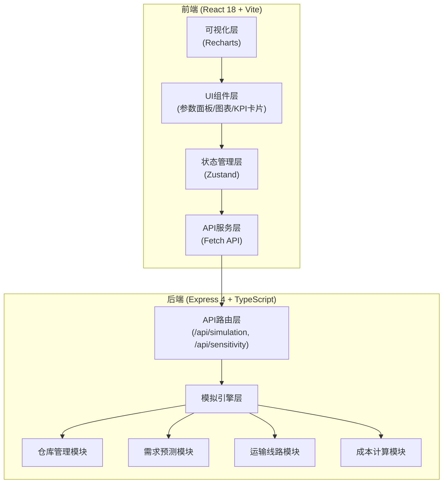
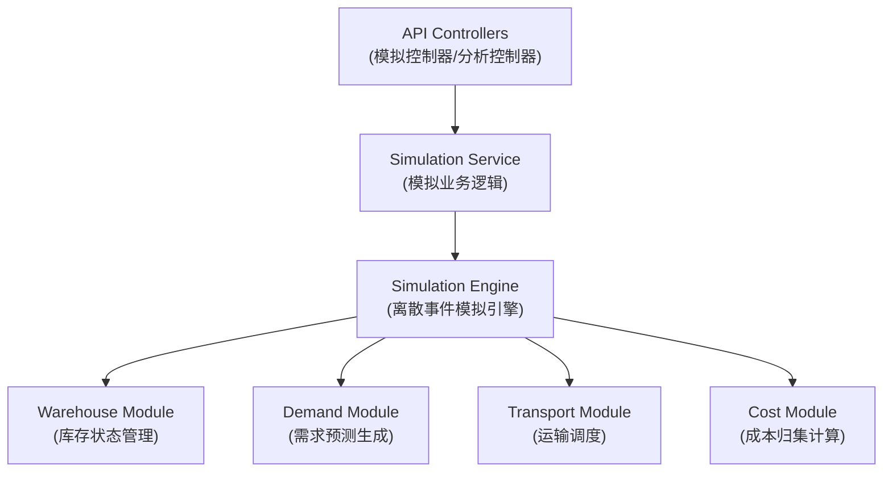
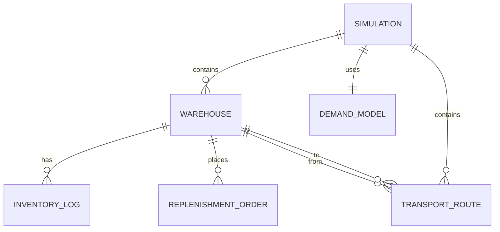

## 1. 架构设计



## 2. 技术描述

- **前端**：React@18 + TypeScript + Vite@5 + TailwindCSS@3 + Zustand@4 + Recharts@2 + lucide-react@0.400
- **初始化工具**：vite-init
- **后端**：Express@4 + TypeScript + ts-node
- **构建工具**：concurrently（前后端并行开发）
- **数据库**：无需数据库，模拟数据全内存计算

## 3. 路由定义

| 路由 | 用途 |
|------|------|
| / | 主模拟面板 |
| /sensitivity | 敏感性分析页面 |

## 4. API 定义

```typescript
// 仓库配置
interface WarehouseConfig {
  id: string;
  name: string;
  initialInventory: number;
  safetyStock: number;      // 安全库存水平
  reorderPoint: number;     // 订货点
  reorderQuantity: number;  // 订货批量
  holdingCostRate: number;  // 单位持有成本率
  orderCost: number;        // 单次订货成本
  stockoutCost: number;     // 单位缺货成本
  leadTime: number;         // 补货提前期(天)
}

// 运输线路
interface TransportRoute {
  id: string;
  fromWarehouseId: string;
  toWarehouseId: string;
  transitTime: number;      // 运输时间(天)
  unitCost: number;         // 单位运输成本
  capacity: number;         // 运输能力
}

// 需求预测模型类型
type DemandModelType = 'constant' | 'trend' | 'seasonal' | 'random';

// 模拟参数
interface SimulationParams {
  warehouses: WarehouseConfig[];
  routes: TransportRoute[];
  demandModel: DemandModelType;
  simulationDays: number;
  baseDemand: number;
  demandVariability: number; // 需求波动系数 0-1
}

// 单次模拟结果
interface SimulationResult {
  totalCost: number;
  inventoryTurnoverRate: number;
  stockoutRate: number;
  dailyInventory: Record<string, number[]>; // warehouseId -> inventory array
  costBreakdown: {
    orderingCost: number;
    holdingCost: number;
    stockoutCost: number;
    transportCost: number;
  };
  warehouseResults: Array<{
    warehouseId: string;
    warehouseName: string;
    avgInventory: number;
    stockoutCount: number;
    turnoverRate: number;
  }>;
}

// 敏感性分析参数组合
interface SensitivityParameter {
  warehouseId: string;
  paramName: 'safetyStock' | 'reorderPoint';
  minValue: number;
  maxValue: number;
  step: number;
}

// 敏感性分析请求
interface SensitivityRequest {
  baseParams: SimulationParams;
  parameters: SensitivityParameter[];
}

// 敏感性分析结果
interface SensitivityResult {
  scenarios: Array<{
    params: Record<string, number>; // warehouseId_paramName -> value
    result: SimulationResult;
  }>;
}

// API 接口
// POST /api/simulation - 运行单次模拟
// 请求体: SimulationParams
// 返回: SimulationResult

// POST /api/sensitivity - 运行敏感性分析
// 请求体: SensitivityRequest
// 返回: SensitivityResult
```

## 5. 后端分层架构



## 6. 数据模型

### 6.1 核心实体关系



### 6.2 模拟引擎状态（内存对象）

```typescript
// 运行时库存状态
interface InventoryState {
  warehouseId: string;
  currentLevel: number;
  inTransit: number;       // 运输中库存
  pendingOrders: Array<{
    orderId: string;
    quantity: number;
    arrivalDay: number;
    fromWarehouseId?: string;
  }>;
  stockoutDays: number;
  totalDemand: number;
  totalStockoutQuantity: number;
  orderCount: number;
}

// 每日模拟快照
interface DailySnapshot {
  day: number;
  inventoryLevels: Record<string, number>;
  demand: Record<string, number>;
  stockouts: string[];     // warehouseIds that had stockout
  ordersPlaced: string[];  // orderIds placed this day
}
```
