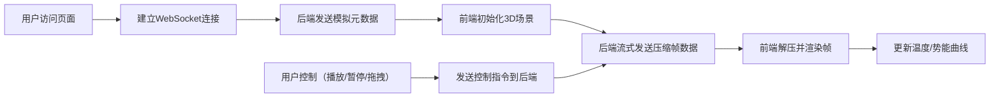

## 1. 产品概述
分子动力学轨迹可视化系统，用于实时展示分子动力学模拟过程。通过 WebSocket 流式传输压缩后的原子坐标数据，前端使用 Three.js 进行 3D 渲染，支持播放控制和物理量实时监测。

- **主要目的**：为科研人员提供直观的分子动力学模拟可视化工具，支持实时观察原子运动轨迹
- **解决问题**：传统分子动力学可视化工具需要下载完整轨迹文件才能查看，本系统支持流式传输和实时播放
- **目标用户**：物理、化学、材料科学领域的科研人员和学生

## 2. 核心特性

### 2.1 用户角色
| 角色 | 注册方式 | 核心权限 |
|------|---------|---------|
| 普通用户 | 无需注册 | 访问可视化页面、播放/暂停模拟、拖拽时间轴、查看物理量曲线 |

### 2.2 功能模块
1. **3D 可视化主界面**：Three.js 渲染原子球体、视角控制、原子类型着色
2. **播放控制模块**：播放/暂停按钮、时间轴拖拽、播放速度调节
3. **物理量监测模块**：温度曲线、势能曲线实时更新
4. **数据传输模块**：WebSocket 流式传输、轨迹数据压缩
5. **模拟源模块**：预生成 LAMMPS 格式轨迹数据、支持实时模拟数据输出

### 2.3 页面详情
| 页面名称 | 模块名称 | 功能描述 |
|---------|---------|----------|
| 主可视化页面 | 3D 渲染区域 | 显示原子三维结构，支持鼠标拖拽旋转、滚轮缩放 |
| 主可视化页面 | 播放控制栏 | 播放/暂停按钮、时间轴滑块、帧信息显示、速度调节 |
| 主可视化页面 | 物理量图表 | 温度随时间变化曲线、势能随时间变化曲线 |
| 主可视化页面 | 状态栏 | 显示连接状态、帧率、数据压缩率信息 |

## 3. 核心流程

### 用户操作流程
用户打开页面后，系统自动连接后端 WebSocket 服务。后端开始流式发送压缩后的轨迹帧数据，前端解压并渲染。用户可随时暂停、拖拽时间轴到任意位置、调节播放速度，实时查看温度和势能变化。

## 4. 界面设计

### 4.1 设计风格
- **主色调**：深色科学主题，深蓝 #0a192f 为主背景
- **辅助色**：青色 #64ffda 高亮、紫色 #bd93f9 强调、橙色 #ffb86c 警示
- **按钮风格**：圆角矩形，悬停时有发光效果
- **字体**：显示字体使用 Orbitron（科技感），正文字体使用 JetBrains Mono（等宽易读）
- **布局风格**：三栏布局，左侧控制面板，中间 3D 渲染区，右侧物理量图表
- **视觉元素**：科技感网格背景、粒子特效、渐变边框、发光阴影

### 4.2 页面设计概览
| 页面名称 | 模块名称 | UI 元素 |
|---------|---------|--------|
| 主可视化页面 | 3D 渲染区域 | 深色背景、原子球体（按类型着色：H=白色, O=红色, C=青色）、网格辅助线、坐标轴指示 |
| 主可视化页面 | 播放控制栏 | 玻璃态背景、发光按钮、滑块时间轴、数字帧计数器、速度选择下拉框 |
| 主可视化页面 | 物理量图表 | 半透明卡片、平滑曲线图表、实时数据点标记、坐标网格线 |
| 主可视化页面 | 状态栏 | 底部细条、连接状态指示灯、帧率显示、压缩率显示 |

### 4.3 响应式设计
- **桌面端（1920+）**：三栏布局，左侧 280px 控制面板，中间自适应渲染区，右侧 350px 图表区
- **平板端（1024-1919）**：两栏布局，控制栏移到底部，右侧图表可折叠
- **移动端（<1024）**：单栏布局，渲染区占满屏幕，控制和图表通过抽屉方式展开

### 4.4 3D 场景设计
- **环境**：深色空间背景，微弱环境光，点光源模拟实验室环境
- **光照**：两盏方向光从不同角度照射，配合环境光产生柔和阴影
- **相机**：PerspectiveCamera，初始位置 (15, 15, 15)，看向原点
- **交互**：OrbitControls 支持旋转、缩放、平移，阻尼效果增强手感
- **原子材质**：MeshStandardMaterial，金属度 0.3，粗糙度 0.4，轻微发光效果
- **后期处理**：Bloom 效果增强发光感，轻微抗锯齿
