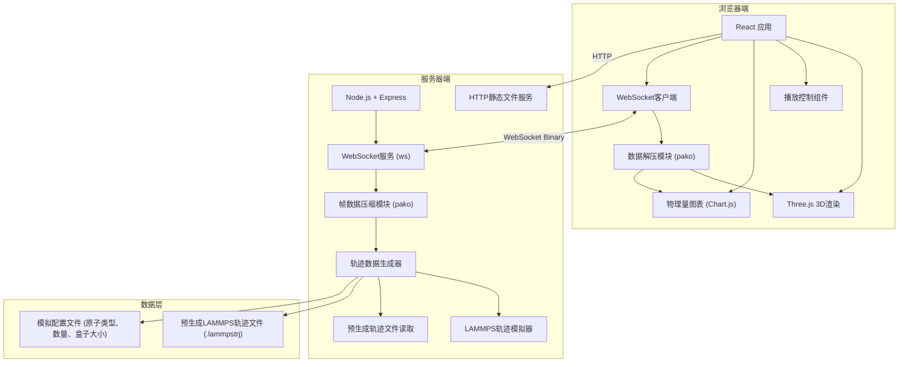

## 1. 架构设计



## 2. 技术栈描述

### 前端技术栈
- **框架**: React 18 + TypeScript
- **构建工具**: Vite 5
- **3D 渲染**: Three.js 0.160 + @react-three/fiber 8 + @react-three/drei 9
- **图表库**: Chart.js 4 + react-chartjs-2 5
- **样式**: TailwindCSS 3
- **数据压缩**: pako 2 (zlib 压缩)
- **WebSocket**: 浏览器原生 WebSocket API

### 后端技术栈
- **运行时**: Node.js 20+
- **Web 框架**: Express 4
- **WebSocket**: ws 8
- **数据压缩**: pako 2
- **文件读取**: Node.js fs 模块 + 流式读取

### 数据格式
- **轨迹格式**: LAMMPS dump 格式 (自定义解析器)
- **传输格式**: 二进制 + zlib 压缩
- **坐标编码**: Float32Array (单精度浮点数，减少数据量)

## 3. 目录结构

```
.
├── server/                          # 后端服务
│   ├── package.json
│   ├── src/
│   │   ├── server.ts               # 主服务器入口
│   │   ├── websocket/
│   │   │   ├── WebSocketServer.ts  # WebSocket 服务管理
│   │   │   └── FrameStreamer.ts    # 帧数据流控制
│   │   ├── trajectory/
│   │   │   ├── LAMMPSSimulator.ts  # LAMMPS 格式模拟生成器
│   │   │   ├── TrajectoryReader.ts # 轨迹文件读取器
│   │   │   └── types.ts            # 轨迹数据类型定义
│   │   └── compression/
│   │       └── Compressor.ts       # 数据压缩模块
│   └── data/
│       ├── config.json             # 模拟配置
│       └── sample.lammpstrj        # 示例轨迹文件
├── client/                          # 前端应用
│   ├── package.json
│   ├── src/
│   │   ├── main.tsx                # 入口文件
│   │   ├── App.tsx                 # 主应用组件
│   │   ├── components/
│   │   │   ├── Visualizer3D.tsx    # 3D 可视化组件
│   │   │   ├── PlaybackControls.tsx # 播放控制组件
│   │   │   ├── PhysicsCharts.tsx   # 物理量图表组件
│   │   │   └── StatusBar.tsx       # 状态栏组件
│   │   ├── hooks/
│   │   │   ├── useWebSocket.ts     # WebSocket 连接 Hook
│   │   │   └── useTrajectory.ts    # 轨迹数据管理 Hook
│   │   ├── utils/
│   │   │   ├── decompressor.ts     # 数据解压模块
│   │   │   └── binaryParser.ts     # 二进制数据解析
│   │   └── types/
│   │       └── index.ts            # 类型定义
│   └── public/
│       └── index.html
└── .trae/documents/                 # 项目文档
```

## 4. 路由定义

| 路由 | 用途 |
|------|------|
| `/` | 主可视化页面 |
| `/api/trajectory/meta` | 获取轨迹元数据 (HTTP GET) |
| `/ws` | WebSocket 连接端点 |

## 5. API 定义

### WebSocket 消息协议

#### 客户端 -> 服务器
```typescript
// 播放控制指令
interface ControlMessage {
  type: 'play' | 'pause' | 'seek' | 'speed';
  frame?: number;      // seek 时使用
  speed?: number;      // speed 时使用 (0.5, 1, 2, 4)
}

// 初始化请求
interface InitMessage {
  type: 'init';
}
```

#### 服务器 -> 客户端
```typescript
// 元数据消息 (JSON)
interface MetaMessage {
  type: 'meta';
  atomCount: number;
  totalFrames: number;
  boxSize: [number, number, number];
  atomTypes: Array<{id: number; name: string; color: string; radius: number}>;
  timestep: number;
}

// 帧数据消息 (二进制 + JSON头)
// 消息结构: [1字节类型标记][4字节未压缩长度][4字节压缩长度][压缩的二进制数据]
// 解压后数据结构:
interface FrameData {
  frame: number;
  time: number;
  temperature: number;
  potentialEnergy: number;
  kineticEnergy: number;
  positions: Float32Array;   // [x1, y1, z1, x2, y2, z2, ...]
  velocities?: Float32Array; // 可选
}
```

### 帧数据压缩格式
- 使用 **delta 编码**：存储与上一帧的坐标差值，进一步减少数据量
- 使用 **zlib (pako)** 对 delta 编码后的数据进行压缩
- 第一帧传输完整坐标，后续帧传输差值
- 压缩率目标：80% 以上（原始数据的 20% 或更少）

## 6. 数据模型

### 6.1 原子类型定义
```typescript
interface AtomType {
  id: number;
  name: string;       // 元素符号: H, O, C, N, etc.
  color: string;      // 十六进制颜色
  radius: number;     // 范德华半径 (缩放后用于渲染)
  mass: number;       // 原子质量
}

// 预定义原子类型
const ATOM_TYPES: Record<string, AtomType> = {
  H: { id: 1, name: 'H', color: '#FFFFFF', radius: 0.31, mass: 1.008 },
  C: { id: 2, name: 'C', color: '#909090', radius: 0.77, mass: 12.011 },
  N: { id: 3, name: 'N', color: '#3050F8', radius: 0.71, mass: 14.007 },
  O: { id: 4, name: 'O', color: '#FF0D0D', radius: 0.66, mass: 15.999 },
  S: { id: 5, name: 'S', color: '#FFFF30', radius: 1.04, mass: 32.065 },
};
```

### 6.2 模拟配置
```json
{
  "systemName": "水分子盒子",
  "atomCount": 512,
  "boxSize": [20.0, 20.0, 20.0],
  "temperature": 300.0,
  "timestep": 0.001,
  "totalFrames": 1000,
  "atomTypes": [1, 4],
  "writeInterval": 10
}
```

### 6.3 帧数据二进制格式 (压缩前)
```
[4字节: frame编号][4字节: 时间][4字节: 温度][4字节: 势能][4字节: 动能]
[原子数 * 12字节: 坐标 (x,y,z 各4字节单精度浮点数)]
```

## 7. 性能优化策略

### 前端优化
1. **InstancedMesh**：使用实例化网格渲染大量原子，减少 draw call
2. **BufferGeometry**：直接操作 Float32Array 更新顶点位置
3. **帧间插值**：在两帧之间进行插值动画，提升流畅度
4. **Web Worker**：数据解压和解析在 Web Worker 中进行，不阻塞主线程
5. **对象池**：复用几何对象和材质，减少 GC

### 后端优化
1. **预生成 + 缓存**：轨迹数据预先生成并缓存，避免重复计算
2. **流式读取**：大轨迹文件使用流式读取，减少内存占用
3. **Delta 压缩**：帧间差值编码，大幅减少传输数据量
4. **批量发送**：可配置每 N 帧打包发送，平衡延迟和带宽
