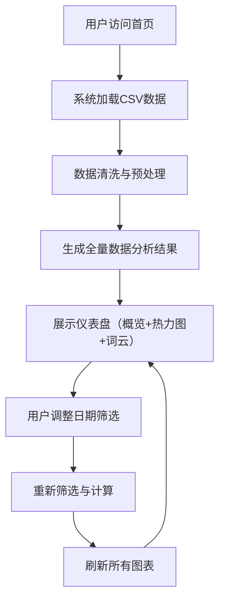

## 1. 产品概述

餐饮业顾客满意度分析工具，帮助餐饮企业通过数据驱动的方式理解顾客评价，发现影响满意度的关键因素，为经营决策提供数据支持。

- **核心目标**：通过多维度数据分析（评分、等待时间、菜品口味、服务态度）量化各因素对顾客总体满意度的影响，并通过文本挖掘提取顾客评价中的关键主题。
- **目标用户**：餐饮企业管理者、运营分析师、门店店长。
- **市场价值**：填补传统餐饮评价仅看总分的不足，提供可量化的相关性分析和可视化洞察，帮助企业针对性改进服务质量。

## 2. 核心功能

### 2.1 用户角色

| 角色 | 注册方式 | 核心权限 |
|------|---------|---------|
| 分析师 | 无需注册，本地部署访问 | 查看全部分析报告、筛选数据、导出图表 |

### 2.2 功能模块

1. **数据概览仪表盘**：总体评分趋势、数据总量、各维度平均分展示
2. **相关性热力图分析**：等待时间、菜品口味、服务态度与总体评分的皮尔逊相关系数可视化
3. **词云分析**：顾客评论文本的关键词提取与词云展示
4. **时间段筛选**：按日期范围动态筛选数据，重新计算分析结果

### 2.3 页面详情

| 页面名称 | 模块名称 | 功能描述 |
|---------|---------|---------|
| 分析仪表盘 | 数据概览卡片 | 展示总体评分均值、评价总数、最近更新时间、最高分/最低分 |
| 分析仪表盘 | 时间段筛选器 | 开始日期、结束日期选择器，应用筛选后刷新所有图表 |
| 分析仪表盘 | 相关性热力图 | 各因素间相关系数矩阵，颜色深浅表示相关性强弱，鼠标悬浮显示具体数值 |
| 分析仪表盘 | 词云展示区 | 动态生成的评论文本词云，支持点击关键词查看相关评论 |
| 分析仪表盘 | 数据统计表 | 展示筛选后的原始数据表格，支持滚动查看 |

## 3. 核心流程

用户访问Web应用 → 系统自动加载并清洗CSV数据 → 默认展示全量数据分析结果（概览、热力图、词云）→ 用户通过日期筛选器选择时间段 → 系统重新计算筛选后的数据 → 所有图表实时刷新 → 用户可查看详细数据。

## 4. 用户界面设计

### 4.1 设计风格

- **主色调**：温暖的橙红色系（#FF6B35）搭配深棕色（#2C1810），呼应餐饮行业主题
- **辅助色**：浅米色背景（#FFF8F0）、暖黄色高亮（#FFD166）
- **按钮风格**：圆角8px，悬停时轻微放大效果，主按钮使用渐变背景
- **字体**：标题使用 Noto Serif SC（衬线体，专业感），正文使用 Noto Sans SC（无衬线体，易读性）
- **布局风格**：卡片式布局，每个分析模块独立成卡，带有柔和阴影和圆角
- **图表风格**：热力图使用暖色调色板（深红-浅黄），词云使用多彩渐变配色

### 4.2 页面设计概述

| 页面名称 | 模块名称 | UI 元素 |
|---------|---------|---------|
| 分析仪表盘 | 顶部导航栏 | 左侧Logo+标题，右侧日期筛选器（开始日期、结束日期、应用按钮） |
| 分析仪表盘 | 数据概览区 | 四个并排的数据卡片，带图标和数值，数值变化动画效果 |
| 分析仪表盘 | 热力图区域 | 居中展示，带标题和说明文字，图例在右侧 |
| 分析仪表盘 | 词云区域 | 与热力图并排展示，响应式布局 |
| 分析仪表盘 | 数据表格 | 底部展示，可折叠，固定表头 |

### 4.3 响应式设计

- **桌面端（≥1200px）**：热力图与词云并排布局，四列数据卡片
- **平板端（768px-1199px）**：热力图与词云垂直堆叠，两列数据卡片
- **移动端（<768px）**：单列布局，筛选器压缩为下拉选择

### 4.4 交互细节

- 页面加载时各模块按顺序淡入动画（staggered reveal）
- 日期筛选应用后，图表有平滑过渡动画
- 热力图单元格悬停显示详情气泡
- 词云文字悬停时放大并显示词频
