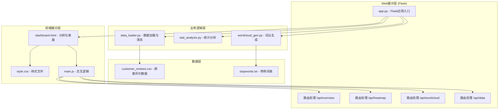
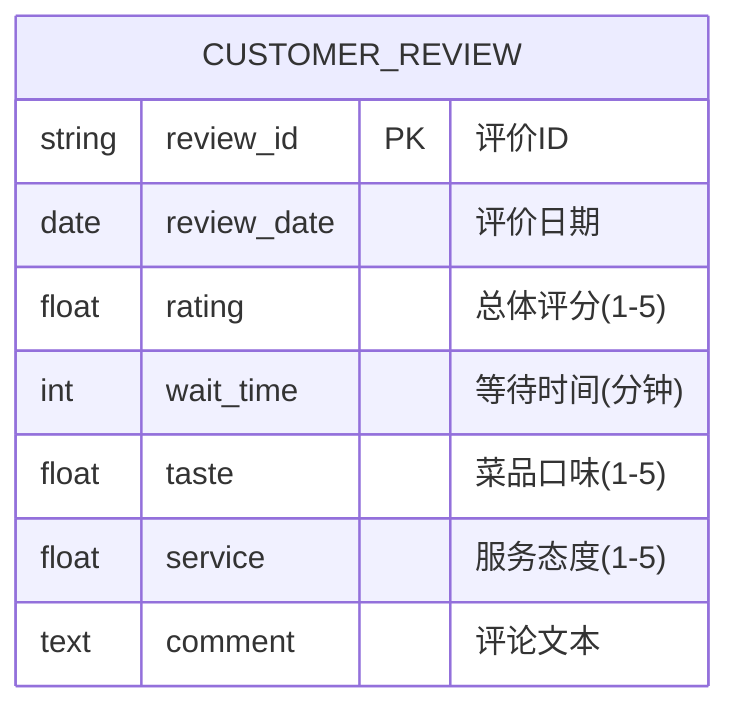

## 1. 架构设计



## 2. 技术栈描述

- **后端框架**：Flask@3.0.0 - 轻量级Python Web框架，适合快速开发数据可视化应用
- **数据处理**：
  - pandas@2.2.0 - CSV数据加载、清洗、筛选
  - numpy@1.26.0 - 数值计算支持
- **统计分析**：
  - scipy@1.12.0 - 皮尔逊相关系数计算
  - seaborn@0.13.0 - 相关性热力图绘制
  - matplotlib@3.8.0 - 图表生成与导出
- **文本分析**：
  - jieba@0.42.1 - 中文分词
  - wordcloud@1.9.3 - 词云生成
- **前端**：
  - 原生HTML5 + CSS3 + JavaScript (ES6+)
  - ECharts@5.5.0 - 热力图和数据可视化（CDN引入）
- **初始化工具**：pip + requirements.txt 管理依赖

## 3. 目录结构

```
project/
├── data/
│   ├── customer_reviews.csv    # 顾客评价原始数据
│   └── stopwords.txt           # 中文停用词表
├── src/
│   ├── __init__.py
│   ├── data_loader.py          # 数据加载与清洗模块
│   ├── stat_analysis.py        # 统计分析模块（相关性计算）
│   └── wordcloud_gen.py        # 词云生成模块
├── templates/
│   └── dashboard.html          # 主页面模板
├── static/
│   ├── css/
│   │   └── style.css           # 样式文件
│   ├── js/
│   │   └── main.js             # 前端交互逻辑
│   └── images/
│       └── (动态生成的词云图片)
├── app.py                      # Flask应用入口
├── requirements.txt            # 依赖清单
└── .trae/
    └── documents/
        ├── PRD.md
        └── Technical-Architecture.md
```

## 4. 模块职责划分

### 4.1 数据加载与清洗模块 (data_loader.py)
- **职责**：负责CSV数据读取、缺失值处理、异常值过滤、日期转换
- **关键函数**：
  - `load_data(filepath)` - 加载原始CSV数据
  - `clean_data(df)` - 数据清洗（去重、填充缺失值、类型转换）
  - `filter_by_date(df, start_date, end_date)` - 按日期范围筛选数据

### 4.2 统计分析模块 (stat_analysis.py)
- **职责**：计算各因素与总体评分的相关性，生成热力图数据
- **关键函数**：
  - `calculate_correlation(df, columns)` - 计算皮尔逊相关系数矩阵
  - `generate_heatmap_data(corr_matrix)` - 转换为ECharts可用的热力图格式
  - `calculate_overview_stats(df)` - 计算概览统计指标

### 4.3 词云生成模块 (wordcloud_gen.py)
- **职责**：中文分词、停用词过滤、词频统计、词云图片生成
- **关键函数**：
  - `preprocess_text(text_series)` - 文本预处理（分词、去停用词）
  - `calculate_word_frequency(words_list, top_n)` - 词频统计
  - `generate_wordcloud_image(word_freq, output_path)` - 生成词云图片

### 4.4 Web展示模块 (app.py + 前端)
- **职责**：提供RESTful API接口，渲染页面，处理前端请求
- **API接口**：
  - `GET /` - 渲染主页面
  - `GET /api/overview?start=&end=` - 获取概览统计数据
  - `GET /api/heatmap?start=&end=` - 获取热力图数据
  - `GET /api/wordcloud?start=&end=` - 获取词云数据和图片
  - `GET /api/data?start=&end=&page=&size=` - 获取分页原始数据

## 5. API 接口定义

### 5.1 概览统计接口
**GET /api/overview**

请求参数：
| 参数 | 类型 | 必填 | 说明 |
|------|------|------|------|
| start | string | 否 | 开始日期 (YYYY-MM-DD) |
| end | string | 否 | 结束日期 (YYYY-MM-DD) |

响应格式：
```json
{
  "code": 200,
  "data": {
    "total_reviews": 1500,
    "avg_rating": 4.2,
    "avg_wait_time": 15.5,
    "avg_taste": 4.3,
    "avg_service": 4.1,
    "max_rating": 5.0,
    "min_rating": 1.0,
    "date_range": ["2024-01-01", "2024-12-31"]
  }
}
```

### 5.2 热力图数据接口
**GET /api/heatmap**

响应格式：
```json
{
  "code": 200,
  "data": {
    "x_axis": ["总体评分", "等待时间", "菜品口味", "服务态度"],
    "y_axis": ["总体评分", "等待时间", "菜品口味", "服务态度"],
    "matrix": [
      [1.00, -0.45, 0.78, 0.65],
      [-0.45, 1.00, -0.32, -0.28],
      [0.78, -0.32, 1.00, 0.58],
      [0.65, -0.28, 0.58, 1.00]
    ]
  }
}
```

### 5.3 词云数据接口
**GET /api/wordcloud**

响应格式：
```json
{
  "code": 200,
  "data": {
    "image_url": "/static/images/wordcloud_123456.png",
    "word_list": [
      {"name": "味道好", "value": 245},
      {"name": "服务好", "value": 189},
      {"name": "上菜慢", "value": 156}
    ]
  }
}
```

## 6. 数据模型

### 6.1 顾客评价数据模型



### 6.2 CSV 数据格式

| 字段名 | 类型 | 说明 | 示例 |
|--------|------|------|------|
| review_id | string | 唯一标识 | R000001 |
| review_date | date | 评价日期 | 2024-05-15 |
| rating | float | 总体评分 | 4.5 |
| wait_time | int | 等待时间(分钟) | 12 |
| taste | float | 菜品口味 | 4.3 |
| service | float | 服务态度 | 4.8 |
| comment | text | 评论文本 | 味道很好，服务热情，就是上菜有点慢 |

## 7. 关键技术决策

1. **词云图片生成**：后端使用wordcloud库生成PNG图片保存到static目录，前端通过URL访问。每次筛选后重新生成并覆盖旧图片。

2. **相关性计算**：使用scipy.stats.pearsonr计算皮尔逊相关系数，范围[-1, 1]，正值表示正相关，负值表示负相关。

3. **中文分词**：使用jieba分词库处理中文评论文本，配合自定义停用词表过滤无意义词汇。

4. **日期筛选**：后端统一处理日期参数，所有分析接口支持可选的start/end参数，无参数时返回全量数据。

5. **前端图表**：使用ECharts绘制热力图，支持交互悬浮显示具体数值，颜色映射采用暖色系配色方案。
