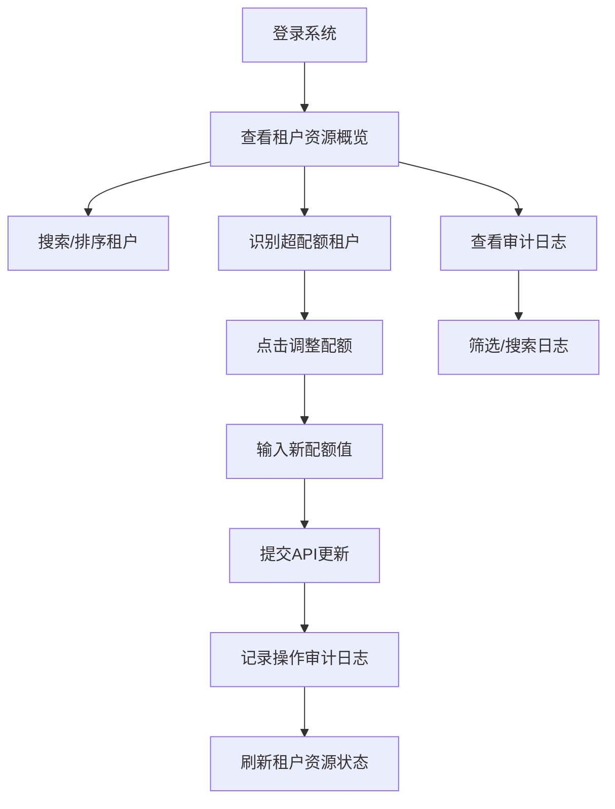

## 1. 产品概述

多租户资源配额管理系统，用于管理员监控和管理多个租户（团队）的计算资源使用情况，包括CPU、内存和存储配额。系统提供实时资源使用可视化、配额调整、超配额告警和操作审计功能，帮助平台管理员高效管控多租户资源分配。

- 主要用途：资源配额监控与调整、超配额预警、操作审计追溯
- 目标用户：平台管理员、运维团队
- 核心价值：提升资源管理效率，防止资源滥用，保障平台稳定性

## 2. 核心功能

### 2.1 用户角色

| 角色 | 注册方式 | 核心权限 |
|------|----------|----------|
| 系统管理员 | 系统内置 | 查看所有租户资源使用情况、调整租户配额、查看操作审计日志、搜索和排序租户 |

### 2.2 功能模块

1. **租户资源概览**：租户卡片列表、资源使用进度条、超配额告警标识
2. **配额调整**：弹窗表单调整CPU/内存/存储配额、实时更新使用状态
3. **操作审计日志**：记录所有配额变更操作、支持按时间/操作人/租户筛选
4. **搜索与排序**：按租户名称搜索、按资源使用率/配额/名称排序

### 2.3 页面详情

| 页面名称 | 模块名称 | 功能描述 |
|----------|----------|----------|
| 主控制台 | 租户列表 | 卡片式展示所有租户，显示名称、CPU/内存/存储配额及使用量、使用率进度条 |
| 主控制台 | 搜索排序栏 | 租户名称搜索框、排序下拉菜单（按名称、CPU使用率、内存使用率、存储使用率） |
| 主控制台 | 配额调整弹窗 | 表单输入新的CPU/内存/存储配额值，确认后提交API更新 |
| 审计日志页 | 日志表格 | 展示操作时间、操作人、操作类型、租户名称、变更前后配额详情 |
| 主控制台 | 告警标识 | 资源使用率超过100%时进度条变红并显示告警图标 |

## 3. 核心流程

管理员进入系统后，首先查看租户资源使用概览，通过进度条直观了解各租户资源使用情况。发现租户超配额或即将超限时，点击调整配额按钮，在弹窗中输入新的配额值并确认提交。系统记录此次操作到审计日志。管理员可随时切换到审计日志页面查看历史操作记录，也可通过搜索和排序功能快速定位特定租户。

## 4. 用户界面设计

### 4.1 设计风格

- 主色调：深蓝色（#1e3a8a）作为主色，代表专业和可信
- 辅助色：绿色（#10b981）表示正常，红色（#ef4444）表示超配额告警，橙色（#f59e0b）表示接近配额
- 按钮风格：圆角4px，悬停时有阴影和颜色加深效果
- 字体：使用 'Inter' 作为主要字体，标题使用700字重，正文使用400-500字重
- 布局风格：顶部导航栏 + 主内容区域卡片式布局，留白充足
- 图标风格：使用 lucide-react 线性图标，保持简洁统一

### 4.2 页面设计概述

| 页面名称 | 模块名称 | UI元素 |
|----------|----------|--------|
| 主控制台 | 顶部导航 | Logo、系统标题、页面切换标签（概览/审计日志）、用户信息 |
| 主控制台 | 统计卡片 | 租户总数、超配额数量、总CPU配额、总内存配额等关键指标 |
| 主控制台 | 租户卡片 | 租户名称、资源类型图标、进度条（带百分比）、配额数值、调整按钮 |
| 主控制台 | 搜索排序 | 左侧搜索框（带放大镜图标）、右侧排序下拉（带箭头图标） |
| 配额调整弹窗 | 表单 | 三个数值输入框（CPU/内存/存储）、当前值展示、确认/取消按钮 |
| 审计日志页 | 日志表格 | 列：时间、操作人、操作、租户、变更详情；支持分页 |

### 4.3 响应式

- 桌面端（默认）：租户卡片每行3-4个，日志表格全列展示
- 平板端（1024px）：租户卡片每行2个，日志表格隐藏部分非关键列
- 移动端（640px）：租户卡片每行1个，日志表格改为卡片式展示
- 触控优化：按钮最小高度44px，间距适配手指点击

