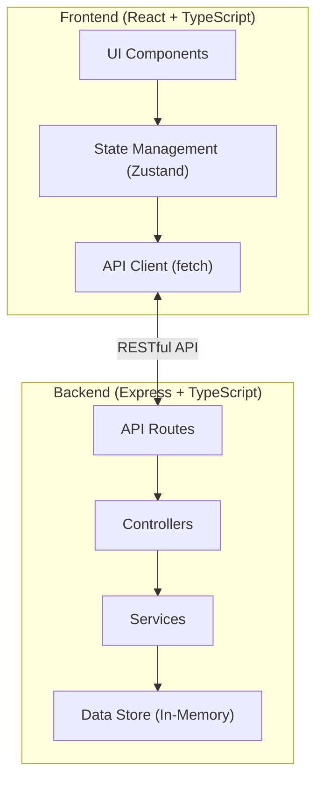
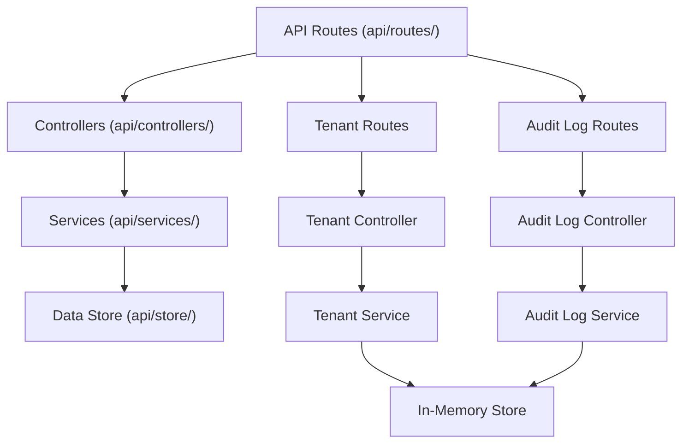
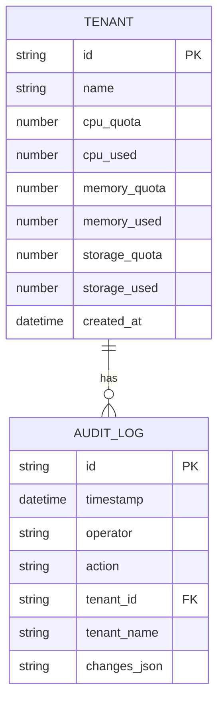

## 1. 架构设计



## 2. 技术描述

- **前端**：React@18 + TypeScript + Vite + TailwindCSS@3 + Zustand + React Router DOM + lucide-react
- **初始化工具**：vite-init
- **后端**：Express@4 + TypeScript + CORS
- **数据库**：内存数据存储（开发演示用），预置Mock数据
- **图标库**：lucide-react

## 3. 路由定义

| 路由 | 页面 | 说明 |
|------|------|------|
| `/` | 租户资源概览 | 展示所有租户的资源使用情况，支持搜索排序和配额调整 |
| `/audit` | 操作审计日志 | 展示配额调整的历史操作记录表格 |

## 4. API 定义

### 4.1 类型定义

```typescript
// 租户资源信息
interface Tenant {
  id: string;
  name: string;
  cpu: {
    quota: number;      // CPU配额（核）
    used: number;       // 已使用CPU
  };
  memory: {
    quota: number;      // 内存配额（GB）
    used: number;       // 已使用内存
  };
  storage: {
    quota: number;      // 存储配额（TB）
    used: number;       // 已使用存储
  };
  createdAt: string;
}

// 审计日志
interface AuditLog {
  id: string;
  timestamp: string;
  operator: string;
  action: 'update_quota';
  tenantId: string;
  tenantName: string;
  changes: {
    resource: 'cpu' | 'memory' | 'storage';
    oldValue: number;
    newValue: number;
  }[];
}

// 配额更新请求
interface UpdateQuotaRequest {
  cpuQuota?: number;
  memoryQuota?: number;
  storageQuota?: number;
}
```

### 4.2 API 接口

| 方法 | 路径 | 说明 | 请求体 | 响应 |
|------|------|------|--------|------|
| GET | `/api/tenants` | 获取租户列表，支持搜索和排序 | Query: `search`, `sortBy`, `sortOrder` | `{ tenants: Tenant[] }` |
| GET | `/api/tenants/:id` | 获取单个租户详情 | - | `{ tenant: Tenant }` |
| PUT | `/api/tenants/:id/quota` | 更新租户配额 | `UpdateQuotaRequest` | `{ tenant: Tenant }` |
| GET | `/api/audit-logs` | 获取审计日志列表 | Query: `page`, `pageSize`, `tenantId` | `{ logs: AuditLog[], total: number }` |

## 5. 服务端架构



## 6. 数据模型

### 6.1 数据模型定义



### 6.2 初始化数据（Mock）

```typescript
// 预置租户数据
const initialTenants: Tenant[] = [
  {
    id: 't001',
    name: '数据平台团队',
    cpu: { quota: 32, used: 28 },
    memory: { quota: 64, used: 52 },
    storage: { quota: 10, used: 8.5 },
    createdAt: '2025-01-15T10:00:00Z'
  },
  {
    id: 't002',
    name: 'AI算法团队',
    cpu: { quota: 64, used: 72 },
    memory: { quota: 128, used: 140 },
    storage: { quota: 50, used: 32 },
    createdAt: '2025-02-20T14:30:00Z'
  },
  {
    id: 't003',
    name: '电商前端团队',
    cpu: { quota: 16, used: 8 },
    memory: { quota: 32, used: 18 },
    storage: { quota: 5, used: 2.3 },
    createdAt: '2025-03-01T09:15:00Z'
  },
  {
    id: 't004',
    name: '金融后端团队',
    cpu: { quota: 48, used: 45 },
    memory: { quota: 96, used: 88 },
    storage: { quota: 20, used: 19.8 },
    createdAt: '2025-03-10T11:45:00Z'
  },
  {
    id: 't005',
    name: '游戏开发团队',
    cpu: { quota: 32, used: 22 },
    memory: { quota: 64, used: 45 },
    storage: { quota: 30, used: 28.5 },
    createdAt: '2025-04-05T16:20:00Z'
  },
  {
    id: 't006',
    name: '移动应用团队',
    cpu: { quota: 24, used: 10 },
    memory: { quota: 48, used: 25 },
    storage: { quota: 8, used: 3.2 },
    createdAt: '2025-04-18T08:30:00Z'
  }
];

// 预置审计日志
const initialAuditLogs: AuditLog[] = [
  {
    id: 'a001',
    timestamp: '2026-05-20T10:30:00Z',
    operator: 'admin',
    action: 'update_quota',
    tenantId: 't002',
    tenantName: 'AI算法团队',
    changes: [
      { resource: 'cpu', oldValue: 48, newValue: 64 },
      { resource: 'memory', oldValue: 96, newValue: 128 }
    ]
  },
  {
    id: 'a002',
    timestamp: '2026-05-22T14:15:00Z',
    operator: 'admin',
    action: 'update_quota',
    tenantId: 't004',
    tenantName: '金融后端团队',
    changes: [
      { resource: 'storage', oldValue: 15, newValue: 20 }
    ]
  },
  {
    id: 'a003',
    timestamp: '2026-05-25T09:45:00Z',
    operator: 'admin',
    action: 'update_quota',
    tenantId: 't001',
    tenantName: '数据平台团队',
    changes: [
      { resource: 'memory', oldValue: 48, newValue: 64 }
    ]
  }
];
```

## 7. 项目结构

```
d:\project\20260508\98/
├── .trae/documents/         # 文档目录
│   ├── prd.md
│   └── tech-arch.md
├── src/                     # 前端代码
│   ├── components/          # 组件
│   │   ├── TenantCard.tsx
│   │   ├── ProgressBar.tsx
│   │   ├── QuotaModal.tsx
│   │   ├── AuditLogTable.tsx
│   │   ├── SearchBar.tsx
│   │   └── StatsCard.tsx
│   ├── pages/               # 页面
│   │   ├── Dashboard.tsx
│   │   └── AuditLogs.tsx
│   ├── store/               # 状态管理
│   │   └── useTenantStore.ts
│   ├── utils/               # 工具函数
│   │   └── api.ts
│   ├── shared/              # 共享类型
│   │   └── types.ts
│   ├── App.tsx
│   ├── main.tsx
│   └── index.css
├── api/                     # 后端代码
│   ├── controllers/
│   │   ├── tenantController.ts
│   │   └── auditLogController.ts
│   ├── routes/
│   │   ├── tenantRoutes.ts
│   │   └── auditLogRoutes.ts
│   ├── services/
│   │   ├── tenantService.ts
│   │   └── auditLogService.ts
│   ├── store/
│   │   └── dataStore.ts
│   ├── index.ts
│   └── types.ts
├── package.json
├── tsconfig.json
├── vite.config.ts
├── tailwind.config.js
└── postcss.config.js
```

